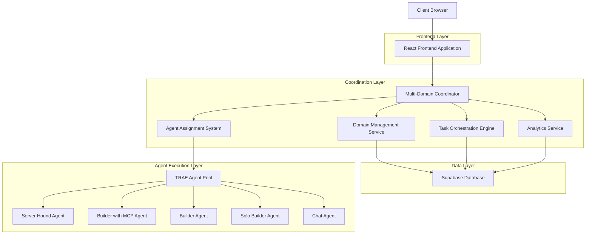
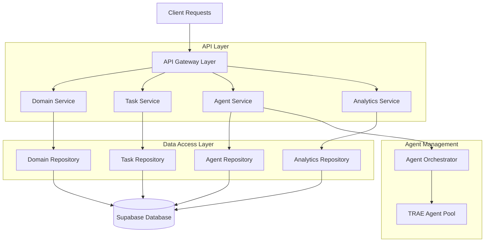
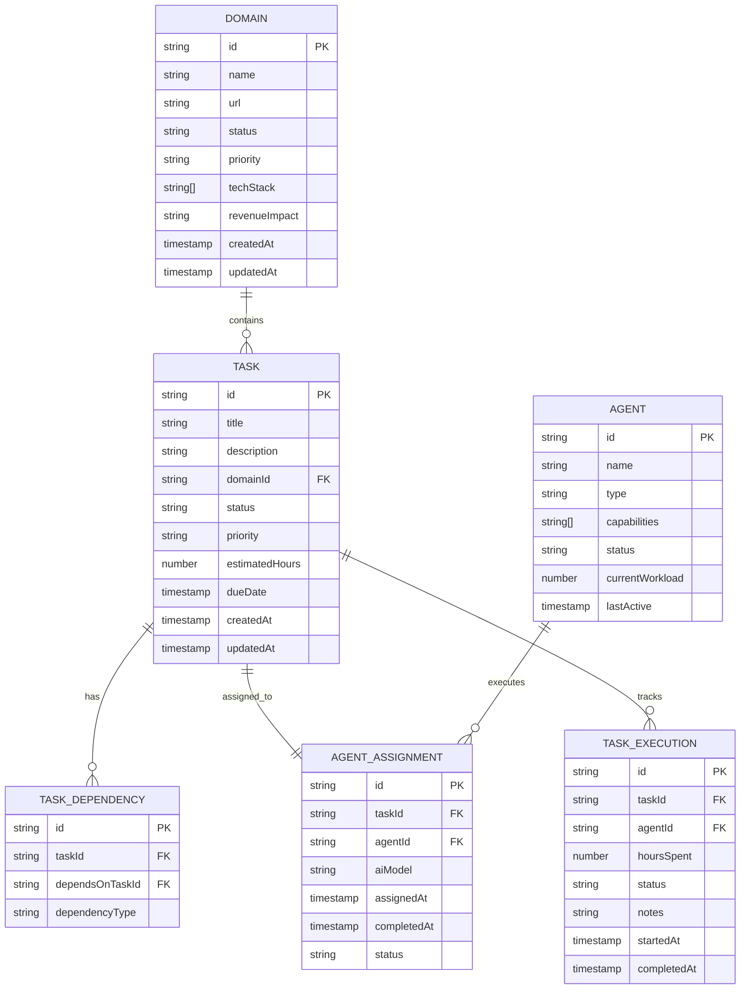

# Multi-Domain Coordination & Automation System - Technical Architecture Document

## 1. Architecture Design



## 2. Technology Description
- Frontend: React@18 + TypeScript@5 + Tailwind CSS@3 + Vite@6
- Backend: Supabase (PostgreSQL + Auth + Real-time)
- State Management: React Context + Zustand
- Agent Communication: WebSocket + REST API
- Analytics: Chart.js + Custom metrics

## 3. Route Definitions
| Route | Purpose |
|-------|---------|
| / | Main dashboard with domain overview and priority queue |
| /domains | Domain management interface for configuration and monitoring |
| /tasks | Task coordination center with creation and dependency mapping |
| /agents | Agent orchestration dashboard with assignment and monitoring |
| /analytics | Analytics and reporting interface with revenue impact metrics |
| /domain/:id | Individual domain detail view with specific metrics |
| /task/:id | Task detail view with execution history and dependencies |

## 4. API Definitions

### 4.1 Core API

**Domain Management**
```
GET /api/domains
```
Response:
| Param Name | Param Type | Description |
|------------|------------|-------------|
| domains | Domain[] | Array of all domain configurations |
| status | string | API response status |

**Task Coordination**
```
POST /api/tasks
```
Request:
| Param Name | Param Type | isRequired | Description |
|------------|------------|------------|-------------|
| title | string | true | Task title |
| description | string | true | Detailed task description |
| domain | string | true | Target domain identifier |
| priority | string | true | Task priority level |
| estimatedHours | number | true | Estimated completion time |
| dependencies | string[] | false | Array of dependent task IDs |

**Agent Assignment**
```
POST /api/agents/assign
```
Request:
| Param Name | Param Type | isRequired | Description |
|------------|------------|------------|-------------|
| taskId | string | true | Task identifier |
| agentType | string | true | TRAE agent type |
| aiModel | string | true | AI model preference |

## 5. Server Architecture Diagram



## 6. Data Model

### 6.1 Data Model Definition



### 6.2 Data Definition Language

**Domain Table**
```sql
-- Create domains table
CREATE TABLE domains (
    id UUID PRIMARY KEY DEFAULT gen_random_uuid(),
    name VARCHAR(255) NOT NULL,
    url VARCHAR(255) UNIQUE NOT NULL,
    status VARCHAR(50) DEFAULT 'placeholder' CHECK (status IN ('placeholder', 'development', 'production', 'maintenance')),
    priority VARCHAR(20) DEFAULT 'medium' CHECK (priority IN ('critical', 'high', 'medium', 'low')),
    tech_stack TEXT[] DEFAULT '{}',
    revenue_impact VARCHAR(20) DEFAULT 'indirect' CHECK (revenue_impact IN ('direct', 'indirect', 'strategic')),
    created_at TIMESTAMP WITH TIME ZONE DEFAULT NOW(),
    updated_at TIMESTAMP WITH TIME ZONE DEFAULT NOW()
);

-- Create tasks table
CREATE TABLE tasks (
    id UUID PRIMARY KEY DEFAULT gen_random_uuid(),
    title VARCHAR(255) NOT NULL,
    description TEXT,
    domain_id UUID REFERENCES domains(id) ON DELETE CASCADE,
    status VARCHAR(20) DEFAULT 'todo' CHECK (status IN ('todo', 'in_progress', 'blocked', 'review', 'done')),
    priority VARCHAR(20) DEFAULT 'medium' CHECK (priority IN ('critical', 'high', 'medium', 'low')),
    estimated_hours INTEGER DEFAULT 0,
    due_date TIMESTAMP WITH TIME ZONE,
    created_at TIMESTAMP WITH TIME ZONE DEFAULT NOW(),
    updated_at TIMESTAMP WITH TIME ZONE DEFAULT NOW()
);

-- Create agents table
CREATE TABLE agents (
    id UUID PRIMARY KEY DEFAULT gen_random_uuid(),
    name VARCHAR(255) NOT NULL,
    type VARCHAR(50) NOT NULL,
    capabilities TEXT[] DEFAULT '{}',
    status VARCHAR(20) DEFAULT 'available' CHECK (status IN ('available', 'busy', 'offline')),
    current_workload INTEGER DEFAULT 0,
    last_active TIMESTAMP WITH TIME ZONE DEFAULT NOW()
);

-- Create task dependencies table
CREATE TABLE task_dependencies (
    id UUID PRIMARY KEY DEFAULT gen_random_uuid(),
    task_id UUID REFERENCES tasks(id) ON DELETE CASCADE,
    depends_on_task_id UUID REFERENCES tasks(id) ON DELETE CASCADE,
    dependency_type VARCHAR(50) DEFAULT 'blocks'
);

-- Create agent assignments table
CREATE TABLE agent_assignments (
    id UUID PRIMARY KEY DEFAULT gen_random_uuid(),
    task_id UUID REFERENCES tasks(id) ON DELETE CASCADE,
    agent_id UUID REFERENCES agents(id) ON DELETE CASCADE,
    ai_model VARCHAR(100),
    assigned_at TIMESTAMP WITH TIME ZONE DEFAULT NOW(),
    completed_at TIMESTAMP WITH TIME ZONE,
    status VARCHAR(20) DEFAULT 'assigned' CHECK (status IN ('assigned', 'in_progress', 'completed', 'failed'))
);

-- Create task execution tracking table
CREATE TABLE task_executions (
    id UUID PRIMARY KEY DEFAULT gen_random_uuid(),
    task_id UUID REFERENCES tasks(id) ON DELETE CASCADE,
    agent_id UUID REFERENCES agents(id) ON DELETE CASCADE,
    hours_spent DECIMAL(5,2) DEFAULT 0,
    status VARCHAR(20) DEFAULT 'started',
    notes TEXT,
    started_at TIMESTAMP WITH TIME ZONE DEFAULT NOW(),
    completed_at TIMESTAMP WITH TIME ZONE
);

-- Create indexes for performance
CREATE INDEX idx_tasks_domain_id ON tasks(domain_id);
CREATE INDEX idx_tasks_status ON tasks(status);
CREATE INDEX idx_tasks_priority ON tasks(priority);
CREATE INDEX idx_agent_assignments_task_id ON agent_assignments(task_id);
CREATE INDEX idx_agent_assignments_agent_id ON agent_assignments(agent_id);
CREATE INDEX idx_task_executions_task_id ON task_executions(task_id);

-- Insert initial domain data
INSERT INTO domains (name, url, status, priority, tech_stack, revenue_impact) VALUES
('Straydog Syndications LLC', 'straydog-syndications-llc.com', 'production', 'high', '{"Next.js", "TypeScript", "Tailwind"}', 'direct'),
('Technical Showcase', 'straydogsyndicationllc.tech', 'placeholder', 'high', '{"Docusaurus", "MDX", "React"}', 'indirect'),
('Services Marketplace', 'straydogsyndicationsllc.biz', 'placeholder', 'critical', '{"Next.js", "Stripe", "Supabase"}', 'direct'),
('Second Story Initiative', 'straydog-secondstory.org', 'production', 'critical', '{"React", "Express", "Supabase", "Claude API"}', 'strategic'),
('Learning Platform', 'education.straydog-syndications.com', 'development', 'medium', '{"Next.js", "Learning Management"}', 'strategic');

-- Insert initial agent data
INSERT INTO agents (name, type, capabilities) VALUES
('Server Hound', 'server_hound', '{"backend_architecture", "database_design", "api_development"}'),
('Builder with MCP', 'builder_with_mcp', '{"full_stack_setup", "deployment", "integration"}'),
('Builder', 'builder', '{"components", "features", "testing"}'),
('Solo Builder', 'solo_builder', '{"ui_design", "styling", "prototyping"}'),
('Chat', 'chat', '{"code_review", "debugging", "consultation"}');
```

## 7. TypeScript Interfaces

```typescript
// Core domain interfaces
interface Domain {
  id: string;
  name: string;
  url: string;
  status: 'placeholder' | 'development' | 'production' | 'maintenance';
  priority: 'critical' | 'high' | 'medium' | 'low';
  techStack: string[];
  revenueImpact: 'direct' | 'indirect' | 'strategic';
  unfinishedTasks: Task[];
  createdAt: Date;
  updatedAt: Date;
}

interface Task {
  id: string;
  title: string;
  description: string;
  domainId: string;
  status: 'todo' | 'in_progress' | 'blocked' | 'review' | 'done';
  priority: 'critical' | 'high' | 'medium' | 'low';
  estimatedHours: number;
  dependencies: string[];
  assignedAgent?: string;
  aiModel?: string;
  dueDate?: Date;
  createdAt: Date;
  updatedAt: Date;
}

interface Agent {
  id: string;
  name: string;
  type: 'server_hound' | 'builder_with_mcp' | 'builder' | 'solo_builder' | 'chat';
  capabilities: string[];
  status: 'available' | 'busy' | 'offline';
  currentWorkload: number;
  lastActive: Date;
}

interface CoordinationPlan {
  assessment: DomainAssessment[];
  executionPlan: ExecutionPlan;
  agentAssignments: AgentAssignment[];
  estimatedCompletion: Date;
  resourceAllocation: ResourceAllocation;
}

interface DomainAssessment {
  domainId: string;
  healthScore: number;
  criticalTasks: number;
  blockedTasks: number;
  estimatedCompletionTime: number;
  revenueImpact: number;
}

interface ExecutionPlan {
  phases: ExecutionPhase[];
  parallelTracks: ParallelTrack[];
  criticalPath: string[];
  totalEstimatedHours: number;
}

interface AgentAssignment {
  agentId: string;
  taskIds: string[];
  estimatedWorkload: number;
  optimalModel: string;
  priority: number;
}
```

## 8. Integration with Marvel Quiz Project

The Multi-Domain Coordination System will be integrated into the existing Marvel Quiz project structure:

- **Location**: `src/coordination/` directory within the Marvel Quiz project
- **Components**: Reuse existing UI components from `src/components/UI/`
- **Styling**: Extend Tailwind configuration to include coordination-specific styles
- **State Management**: Integrate with existing GameContext pattern
- **API Integration**: Extend existing Supabase configuration
- **Routing**: Add coordination routes to existing React Router setup

This integration allows the Marvel Quiz project to serve as a demonstration of the coordination system's capabilities while maintaining its core functionality.