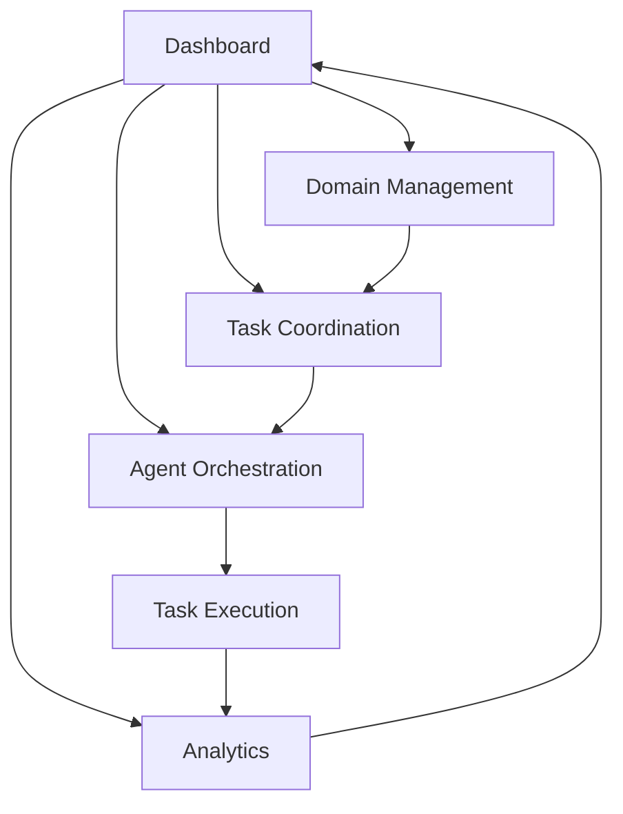

# Multi-Domain Coordination & Automation System - Product Requirements Document

## 1. Product Overview
A centralized coordination system that manages and orchestrates development tasks across 5 distinct business domains: corporate, tech, business, nonprofit, and education platforms. The system prioritizes tasks based on revenue impact, manages dependencies, and optimizes resource allocation using AI agents.

- **Primary Purpose**: Streamline multi-domain development workflows, maximize revenue impact through intelligent task prioritization, and coordinate TRAE agent assignments across all business verticals.
- **Target Market**: Multi-domain business operations requiring coordinated development efforts with revenue optimization focus.

## 2. Core Features

### 2.1 User Roles
| Role | Registration Method | Core Permissions |
|------|---------------------|------------------|
| Domain Manager | Admin invitation | Full domain management, task creation, agent assignment |
| Project Lead | Manager invitation | Task management within assigned domains, progress tracking |
| Developer | Team invitation | Task execution, status updates, time logging |
| AI Agent | System integration | Automated task execution, status reporting |

### 2.2 Feature Module
Our Multi-Domain Coordination System consists of the following main pages:
1. **Dashboard**: Domain status overview, priority task queue, resource allocation metrics
2. **Domain Management**: Individual domain configuration, tech stack management, status tracking
3. **Task Coordination**: Cross-domain task creation, dependency mapping, priority assignment
4. **Agent Orchestration**: TRAE agent assignment, workload distribution, performance monitoring
5. **Analytics**: Revenue impact analysis, completion time tracking, resource optimization insights

### 2.3 Page Details
| Page Name | Module Name | Feature description |
|-----------|-------------|---------------------|
| Dashboard | Domain Overview | Display real-time status of all 5 domains with color-coded priority indicators |
| Dashboard | Priority Queue | Show top 10 critical tasks sorted by revenue impact and dependencies |
| Dashboard | Resource Metrics | Visualize agent workload distribution and estimated completion times |
| Domain Management | Domain Configuration | Configure domain settings, tech stack, deployment status, and priority levels |
| Domain Management | Status Tracking | Monitor domain health, deployment status, and unfinished task counts |
| Task Coordination | Task Creation | Create tasks with domain assignment, priority, dependencies, and time estimates |
| Task Coordination | Dependency Mapping | Visual dependency graph showing task relationships and blocking issues |
| Task Coordination | Priority Engine | Automated priority calculation based on revenue impact and business criticality |
| Agent Orchestration | Agent Assignment | Assign optimal TRAE agents based on task type and agent capabilities |
| Agent Orchestration | Workload Balancing | Distribute tasks across agents to optimize parallel processing |
| Agent Orchestration | Performance Monitoring | Track agent efficiency, completion rates, and quality metrics |
| Analytics | Revenue Impact | Calculate and display revenue impact of completed vs pending tasks |
| Analytics | Time Tracking | Monitor actual vs estimated completion times for continuous improvement |
| Analytics | Resource Optimization | Provide recommendations for optimal resource allocation |

## 3. Core Process

### Domain Manager Flow
1. Access dashboard to review overall system status
2. Configure domain settings and priorities in Domain Management
3. Create high-level tasks in Task Coordination
4. Assign agents through Agent Orchestration
5. Monitor progress through Analytics

### AI Agent Flow
1. Receive task assignments from orchestration system
2. Execute tasks based on priority and dependencies
3. Report progress and completion status
4. Request additional resources if needed

## 4. User Interface Design

### 4.1 Design Style
- **Primary Colors**: Corporate Blue (#1e40af), Success Green (#059669), Warning Orange (#d97706)
- **Secondary Colors**: Neutral Gray (#6b7280), Background Light (#f8fafc)
- **Button Style**: Rounded corners with subtle shadows, hover animations
- **Font**: Inter for headings (16-24px), system fonts for body text (14-16px)
- **Layout Style**: Card-based design with glassmorphic elements, top navigation with sidebar
- **Icons**: Lucide React icons for consistency, domain-specific icons for visual hierarchy

### 4.2 Page Design Overview
| Page Name | Module Name | UI Elements |
|-----------|-------------|-------------|
| Dashboard | Domain Overview | Grid layout with 5 domain cards, status indicators (green/yellow/red), progress bars |
| Dashboard | Priority Queue | Vertical list with priority badges, estimated time chips, dependency indicators |
| Task Coordination | Task Creation | Modal form with dropdown selectors, date pickers, multi-select for dependencies |
| Agent Orchestration | Agent Assignment | Drag-and-drop interface, agent capability badges, workload visualization charts |
| Analytics | Revenue Impact | Interactive charts with revenue projections, completion rate metrics |

### 4.3 Responsiveness
Desktop-first design with mobile-adaptive breakpoints. Touch-optimized interactions for tablet use, with collapsible sidebar navigation for smaller screens.