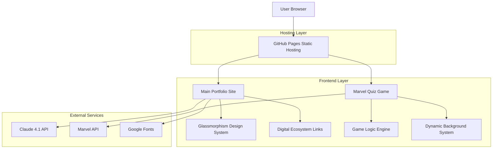
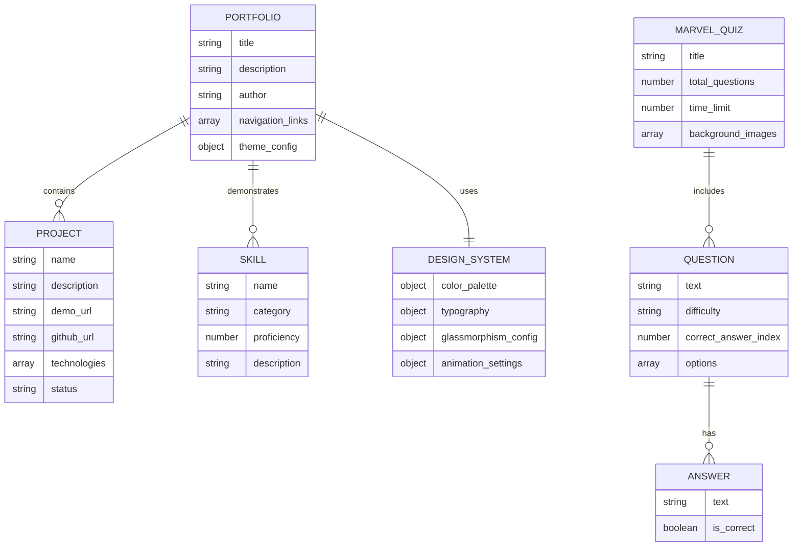

# Portfolio Technical Architecture Document

## 1. Architecture Design



## 2. Technology Description

- **Frontend**: HTML5 + CSS3 + Vanilla JavaScript
- **Styling**: CSS Custom Properties + Glassmorphism Design System
- **Hosting**: GitHub Pages (Static Site)
- **Build Tools**: None (Direct HTML/CSS/JS deployment)
- **External APIs**: Claude 4.1 API, Marvel API (optional)
- **Fonts**: Google Fonts (Inter family)
- **Icons**: Custom brand assets + Unicode emojis

## 3. Route Definitions

| Route | Purpose |
|-------|----------|
| `/` | Main portfolio homepage with glassmorphism design |
| `/marvel-quiz-game/` | Interactive Marvel trivia game with dynamic backgrounds |
| `/assets/brands/` | Brand assets and logo files |
| `/assets/comics/` | Marvel character background images |

## 4. API Definitions

### 4.1 Core API Integration

**Claude 4.1 API Integration (Future Enhancement)**
```javascript
// AI Content Generation
POST https://api.anthropic.com/v1/messages
```

Request:
| Param Name | Param Type | isRequired | Description |
|------------|------------|------------|-------------|
| model | string | true | Claude model version |
| messages | array | true | Conversation context |
| max_tokens | number | true | Response length limit |

Response:
| Param Name | Param Type | Description |
|------------|------------|-------------|
| content | string | Generated content |
| usage | object | Token usage statistics |

**Marvel API Integration (Optional)**
```javascript
// Character Data Fetching
GET https://gateway.marvel.com/v1/public/characters
```

Request:
| Param Name | Param Type | isRequired | Description |
|------------|------------|------------|-------------|
| apikey | string | true | Marvel API public key |
| ts | string | true | Timestamp |
| hash | string | true | MD5 hash of ts+privateKey+publicKey |

Response:
| Param Name | Param Type | Description |
|------------|------------|-------------|
| data | object | Character data results |
| status | string | API response status |

## 5. Data Model

### 5.1 Data Model Definition



### 5.2 Data Definition Language

**Portfolio Configuration (JavaScript Object)**
```javascript
// Portfolio metadata
const portfolioConfig = {
  title: "Eric 'Hunter' Petross | AI/ML Engineer & Technical Architect",
  description: "AI/ML Engineer & Technical Architect. Transforming 20+ years of customer excellence into cutting-edge technical solutions.",
  author: "Eric Hunter Petross",
  navigation: [
    { name: "Home", href: "#home" },
    { name: "Demo", href: "#demo" },
    { name: "Skills", href: "#skills" },
    { name: "Portfolio", href: "#portfolio" },
    { name: "Contact", href: "#contact" }
  ],
  ecosystem: [
    {
      title: "StrayDog Syndications LLC",
      url: "https://www.straydog-syndications-llc.com",
      description: "Main company portal"
    },
    {
      title: "Second Story",
      url: "https://www.straydog-secondstory.org",
      description: "Non-profit platform"
    },
    {
      title: "Business Portal",
      url: "https://straydogsyndicationsllc.biz",
      description: "Business consulting"
    },
    {
      title: "Tech Portfolio",
      url: "https://straydogsyndicationsllc.tech",
      description: "Technical showcase"
    }
  ]
};

// Design system configuration
const designSystem = {
  colors: {
    primary: "#355E3B",
    accentBlack: "#0B0B0B",
    darkGray: "#1E1E1E",
    lightContrast: "#F5F5F5",
    secondaryAccent: "#A3B9A4",
    utilityGray: "#3F3F3F",
    highlight: "#C2C2C2"
  },
  glassmorphism: {
    background: "rgba(255, 255, 255, 0.1)",
    border: "1px solid rgba(255, 255, 255, 0.2)",
    backdropFilter: "blur(10px)",
    borderRadius: "20px",
    boxShadow: "0 8px 32px 0 rgba(31, 38, 135, 0.37)"
  },
  typography: {
    fontFamily: "-apple-system, BlinkMacSystemFont, 'Segoe UI', 'Inter', system-ui, sans-serif",
    fontSizes: {
      xs: "0.75rem",
      sm: "0.875rem",
      base: "1rem",
      lg: "1.125rem",
      xl: "1.25rem",
      "2xl": "1.5rem",
      "3xl": "1.875rem",
      "4xl": "2.25rem"
    }
  }
};

// Marvel Quiz game data
const marvelQuizData = {
  title: "Marvel Quiz Game",
  totalQuestions: 8,
  timeLimit: 30,
  backgroundImages: [
    "./assets/comics/ironman-bg.jpg",
    "./assets/comics/spiderman-bg.jpg",
    "./assets/comics/thor-bg.jpg",
    "./assets/comics/hulk-bg.jpg",
    "./assets/comics/captain-america-bg.jpg",
    "./assets/comics/black-widow-bg.jpg",
    "./assets/comics/doctor-strange-bg.jpg",
    "./assets/comics/guardians-bg.jpg"
  ],
  questions: [
    {
      question: "What is the real name of the superhero known as Iron Man?",
      options: ["Tony Stark", "Bruce Wayne", "Peter Parker", "Steve Rogers"],
      correct: 0,
      difficulty: "easy"
    },
    {
      question: "Which Infinity Stone is hidden on Vormir?",
      options: ["Power Stone", "Soul Stone", "Reality Stone", "Time Stone"],
      correct: 1,
      difficulty: "medium"
    },
    {
      question: "What is the name of Thor's hammer?",
      options: ["Stormbreaker", "Gungnir", "Mjolnir", "Hofund"],
      correct: 2,
      difficulty: "easy"
    },
    {
      question: "Who is the leader of the Guardians of the Galaxy?",
      options: ["Rocket Raccoon", "Star-Lord", "Gamora", "Drax"],
      correct: 1,
      difficulty: "easy"
    },
    {
      question: "What is the name of the AI that helps Tony Stark?",
      options: ["FRIDAY", "KAREN", "JARVIS", "EDITH"],
      correct: 2,
      difficulty: "medium"
    },
    {
      question: "Which planet is Thanos from?",
      options: ["Asgard", "Titan", "Xandar", "Sakaar"],
      correct: 1,
      difficulty: "medium"
    },
    {
      question: "What is the real name of the Winter Soldier?",
      options: ["Sam Wilson", "Bucky Barnes", "Clint Barton", "Scott Lang"],
      correct: 1,
      difficulty: "easy"
    },
    {
      question: "In which movie did Spider-Man first appear in the MCU?",
      options: ["Spider-Man: Homecoming", "Avengers: Infinity War", "Captain America: Civil War", "Spider-Man: Far From Home"],
      correct: 2,
      difficulty: "hard"
    }
  ]
};

// Project showcase data
const projectsData = [
  {
    name: "Marvel Quiz Game",
    description: "Interactive trivia game with dynamic Marvel character backgrounds and glassmorphism design",
    demoUrl: "./marvel-quiz-game/",
    githubUrl: "https://github.com/StrayDogSyn/Learner-Files-v3.5",
    technologies: ["HTML5", "CSS3", "JavaScript", "Glassmorphism", "Responsive Design"],
    status: "active"
  },
  {
    name: "AI Portfolio System",
    description: "Claude 4.1 integrated portfolio with dynamic content generation and modern design",
    demoUrl: "./",
    githubUrl: "https://github.com/StrayDogSyn/Learner-Files-v3.5",
    technologies: ["Claude 4.1", "HTML5", "CSS3", "JavaScript", "GitHub Pages"],
    status: "active"
  }
];
```

## 6. Performance Optimization Strategy

### 6.1 Asset Optimization
```javascript
// Image optimization configuration
const assetOptimization = {
  images: {
    formats: ["webp", "jpg", "png"],
    compression: 85,
    lazyLoading: true,
    preloadCritical: [
      "./assets/brands/mainLogo.png",
      "./assets/brands/gearLogo.png"
    ]
  },
  css: {
    minification: true,
    criticalCSS: true,
    fontDisplay: "swap"
  },
  javascript: {
    minification: true,
    moduleLoading: "defer",
    criticalPath: ["navigation", "glassmorphism"]
  }
};
```

### 6.2 Caching Strategy
```javascript
// Service worker configuration (future enhancement)
const cachingStrategy = {
  staticAssets: {
    strategy: "cacheFirst",
    maxAge: "30d",
    assets: ["css", "js", "images", "fonts"]
  },
  dynamicContent: {
    strategy: "networkFirst",
    maxAge: "1d",
    fallback: "offline.html"
  },
  apiResponses: {
    strategy: "staleWhileRevalidate",
    maxAge: "1h"
  }
};
```

## 7. Security Considerations

### 7.1 Content Security Policy
```html
<!-- CSP Header Configuration -->
<meta http-equiv="Content-Security-Policy" content="
  default-src 'self';
  script-src 'self' 'unsafe-inline' https://fonts.googleapis.com;
  style-src 'self' 'unsafe-inline' https://fonts.googleapis.com;
  font-src 'self' https://fonts.gstatic.com;
  img-src 'self' data: https:;
  connect-src 'self' https://api.anthropic.com https://gateway.marvel.com;
">
```

### 7.2 API Security
```javascript
// API key management (environment variables)
const apiConfig = {
  claude: {
    endpoint: "https://api.anthropic.com/v1/messages",
    keyStorage: "environment", // Never in client-side code
    rateLimiting: true
  },
  marvel: {
    endpoint: "https://gateway.marvel.com/v1/public",
    publicKey: "environment", // Public key only
    hashGeneration: "server-side" // Private key never exposed
  }
};
```

## 8. Deployment Configuration

### 8.1 GitHub Pages Setup
```yaml
# .github/workflows/deploy.yml
name: Deploy to GitHub Pages
on:
  push:
    branches: [ main ]
  pull_request:
    branches: [ main ]

jobs:
  deploy:
    runs-on: ubuntu-latest
    steps:
    - uses: actions/checkout@v3
    - name: Setup Pages
      uses: actions/configure-pages@v3
    - name: Upload artifact
      uses: actions/upload-pages-artifact@v2
      with:
        path: './'
    - name: Deploy to GitHub Pages
      uses: actions/deploy-pages@v2
```

### 8.2 Build Optimization
```json
{
  "scripts": {
    "build": "npm run optimize:images && npm run minify:css && npm run minify:js",
    "optimize:images": "imagemin src/assets/**/* --out-dir=assets/",
    "minify:css": "cleancss -o style.min.css style.css",
    "minify:js": "terser script.js -o script.min.js",
    "deploy": "npm run build && git add . && git commit -m 'Deploy' && git push"
  }
}
```

## 9. Monitoring & Analytics

### 9.1 Performance Monitoring
```javascript
// Performance tracking configuration
const performanceConfig = {
  metrics: [
    "First Contentful Paint",
    "Largest Contentful Paint",
    "Cumulative Layout Shift",
    "First Input Delay"
  ],
  targets: {
    lighthouse: 90,
    loadTime: 3000, // 3 seconds
    mobileUsability: 100
  },
  reporting: {
    interval: "daily",
    alerts: true
  }
};
```

### 9.2 User Analytics
```javascript
// Privacy-focused analytics (future enhancement)
const analyticsConfig = {
  provider: "privacy-focused", // No Google Analytics
  trackingEvents: [
    "page_view",
    "quiz_start",
    "quiz_complete",
    "project_demo_click",
    "ecosystem_link_click"
  ],
  dataRetention: "30d",
  userConsent: true
};
```

This technical architecture provides a solid foundation for the portfolio repair and enhancement plan, focusing on modern web standards, performance optimization, and scalable design patterns while maintaining simplicity for GitHub Pages deployment.