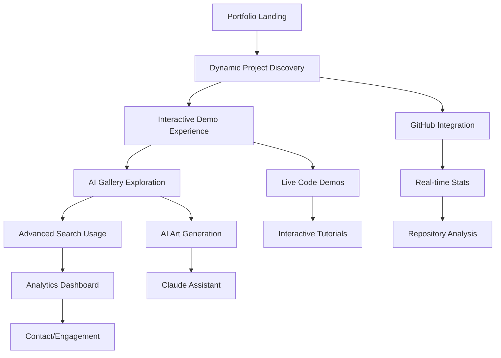

# Dynamic Portfolio Enhancement - Product Requirements Document

## 1. Product Overview

Transform the existing static StrayDog portfolio into a cutting-edge dynamic platform that showcases 10x programmer skillset while preserving the successful hunter green glassmorphic brand identity. The enhanced portfolio will feature dynamic project discovery, AI integration, interactive demos, and real-time GitHub analytics.

- **Core Purpose**: Elevate static portfolio to dynamic showcase platform demonstrating advanced technical capabilities
- **Target Audience**: Technical recruiters, potential clients, and development community seeking evidence of elite programming skills
- **Market Value**: Position as premium developer portfolio that stands out in competitive tech landscape

## 2. Core Features

### 2.1 User Roles

| Role | Access Method | Core Permissions |
|------|---------------|------------------|
| Visitor | Direct access | Browse portfolio, view projects, interact with demos |
| Recruiter | Enhanced analytics | Access detailed project metrics, download resume, contact forms |
| Developer | GitHub integration | View source code, fork projects, access technical documentation |

### 2.2 Feature Module

Our dynamic portfolio enhancement consists of the following main components:

1. **Dynamic Project Discovery**: Automated repository analysis, real-time GitHub stats, intelligent project categorization
2. **AI Artwork Gallery**: Generative AI showcase, interactive art creation, portfolio of AI-generated content
3. **Interactive Demo Hub**: Embedded project experiences, live code examples, interactive tutorials
4. **Advanced Analytics Dashboard**: Performance tracking, visitor insights, engagement metrics
5. **Intelligent Search System**: AI-powered project discovery, skill-based filtering, semantic search
6. **Real-time Integration Layer**: GitHub API connectivity, live data feeds, dynamic content updates

### 2.3 Page Details

| Page Name | Module Name | Feature Description |
|-----------|-------------|---------------------|
| Enhanced Home | Dynamic Hero Section | Real-time GitHub stats display, animated skill metrics, live project counters |
| Enhanced Home | Intelligent Project Grid | Auto-populated from GitHub repos, dynamic status indicators, smart categorization |
| Project Discovery | Repository Analysis Engine | Automated code analysis, technology detection, complexity scoring |
| Project Discovery | Interactive Project Cards | Live demos, code previews, deployment status, performance metrics |
| AI Gallery | Generative Art Showcase | AI-created artwork display, creation process documentation, interactive generation |
| AI Gallery | AI Integration Demos | Claude assistant integration, AI-powered features, machine learning showcases |
| Analytics Dashboard | Performance Metrics | Site analytics, project engagement, visitor insights, conversion tracking |
| Analytics Dashboard | GitHub Integration | Real-time repository stats, contribution graphs, activity feeds |
| Advanced Search | Intelligent Discovery | AI-powered search, skill-based filtering, semantic project matching |
| Interactive Demos | Live Code Environment | Embedded CodePen/JSFiddle, interactive tutorials, real-time code execution |

## 3. Core Process

### Progressive Enhancement Flow

1. **Foundation Verification**: Ensure current static portfolio maintains functionality and branding
2. **Dynamic Layer Addition**: Implement GitHub API integration for real-time data
3. **AI Feature Integration**: Add Claude assistant and generative art capabilities
4. **Interactive Component Development**: Build embedded demos and live code environments
5. **Analytics Implementation**: Deploy tracking and performance monitoring
6. **Search Enhancement**: Implement intelligent discovery system
7. **Performance Optimization**: Ensure GitHub Pages compatibility and fast loading

### User Journey Flow

## 4. User Interface Design

### 4.1 Design Style

**Preserved Brand Elements:**
- **Primary Colors**: Hunter Green (#4A7C59), Deep Forest (#2D5016)
- **Secondary Colors**: Accent Green (#52D681), Light Contrast (#E8F5E8)
- **Glassmorphic Effects**: Backdrop blur, translucent backgrounds, subtle borders
- **Typography**: Modern sans-serif, clean hierarchy, readable contrast
- **Layout Style**: Card-based design, responsive grid, smooth animations
- **Icon Style**: Minimalist, consistent sizing, hunter green accent colors

**Enhanced Dynamic Elements:**
- **Animated Counters**: Real-time GitHub stats with smooth number transitions
- **Interactive Hover States**: Enhanced glassmorphic effects on interaction
- **Loading Animations**: Skeleton screens maintaining brand aesthetic
- **Progress Indicators**: Hunter green progress bars and loading states

### 4.2 Page Design Overview

| Page Name | Module Name | UI Elements |
|-----------|-------------|-------------|
| Enhanced Home | Dynamic Stats Bar | Real-time counters, animated numbers, glassmorphic containers with hunter green accents |
| Project Discovery | Smart Grid Layout | Auto-adjusting card grid, dynamic filtering UI, smooth transitions |
| AI Gallery | Interactive Art Grid | Masonry layout, hover previews, generation controls with hunter green styling |
| Analytics Dashboard | Data Visualization | Charts and graphs with hunter green color scheme, glassmorphic panels |
| Search Interface | Intelligent Input | Auto-complete, filter chips, results highlighting with brand colors |

### 4.3 Responsiveness

Mobile-first responsive design with enhanced touch interactions, optimized for both desktop portfolio viewing and mobile recruitment scenarios. All dynamic features maintain functionality across devices.

## 5. Technical Constraints

### GitHub Pages Compatibility Requirements

- **Static Site Generation**: All dynamic features must compile to static assets
- **No Server-Side Processing**: Client-side JavaScript for all dynamic functionality
- **Asset Optimization**: Minimize bundle sizes for fast GitHub Pages deployment
- **Browser Compatibility**: Support modern browsers with graceful degradation

### Prohibited Technologies

- **Tailwind CSS 4.x**: Known deployment issues with GitHub Pages
- **React Fiber 3.x**: Compatibility problems with static generation
- **Server-Side Frameworks**: Node.js, Express, or any backend requirements
- **Database Dependencies**: No external database connections

### Approved Technology Stack

- **Core**: Vanilla JavaScript ES6+, CSS3 with custom properties
- **Build Tools**: Vite (current setup), standard bundling
- **APIs**: GitHub REST API, public APIs only
- **Styling**: Custom CSS with preserved glassmorphic effects
- **Deployment**: GitHub Actions with Pages deployment