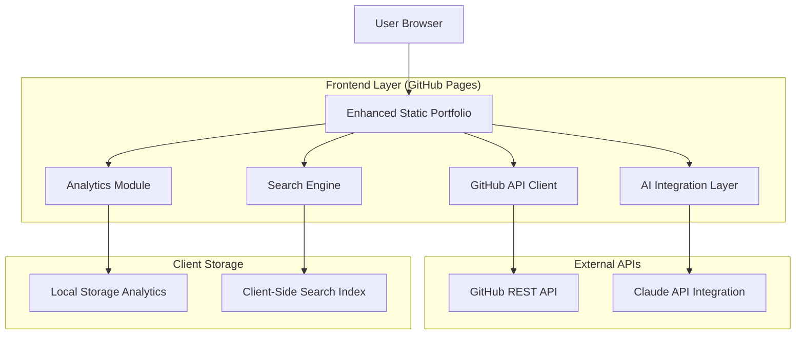
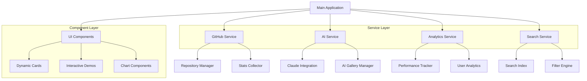

# Dynamic Portfolio Enhancement - Technical Architecture Document

## 1. Architecture Design



## 2. Technology Description

**Core Stack (GitHub Pages Compatible):**

* Frontend: Vanilla JavaScript ES6+ + Custom CSS3 + Vite build system

* APIs: GitHub REST API v4, Claude API (client-side integration)

* Storage: LocalStorage + SessionStorage for caching

* Build: Vite bundler with static asset optimization

* Deployment: GitHub Actions + GitHub Pages

**Key Libraries:**

* Chart.js v3.9 (data visualization)

* Intersection Observer API (scroll animations)

* Fetch API (HTTP requests)

* CSS Custom Properties (dynamic theming)

## 3. Route Definitions

| Route        | Purpose                                           |
| ------------ | ------------------------------------------------- |
| /            | Enhanced home page with dynamic project discovery |
| /#projects   | Dynamic project showcase with GitHub integration  |
| /#ai-gallery | AI artwork gallery and generative demos           |
| /#analytics  | Performance dashboard and GitHub stats            |
| /#search     | Advanced search and filtering interface           |
| /#demos      | Interactive demo hub with embedded experiences    |

## 4. API Definitions

### 4.1 GitHub Integration APIs

**Repository Analysis**

```
GET https://api.github.com/users/StrayDogSyn/repos
```

Request Headers:

| Header Name | Value                          | Required | Description            |
| ----------- | ------------------------------ | -------- | ---------------------- |
| Accept      | application/vnd.github.v3+json | true     | GitHub API version     |
| User-Agent  | StrayDog-Portfolio/1.0         | true     | Application identifier |

Response:

| Field Name        | Type   | Description                  |
| ----------------- | ------ | ---------------------------- |
| name              | string | Repository name              |
| description       | string | Project description          |
| language          | string | Primary programming language |
| stargazers\_count | number | GitHub stars                 |
| updated\_at       | string | Last update timestamp        |

**User Statistics**

```
GET https://api.github.com/users/StrayDogSyn
```

Response:

| Field Name    | Type   | Description               |
| ------------- | ------ | ------------------------- |
| public\_repos | number | Total public repositories |
| followers     | number | GitHub followers count    |
| following     | number | Following count           |
| created\_at   | string | Account creation date     |

### 4.2 AI Integration APIs

**Claude Assistant Integration**

```
POST /api/claude/chat
```

Request:

| Param Name | Param Type | Required | Description        |
| ---------- | ---------- | -------- | ------------------ |
| message    | string     | true     | User input message |
| context    | string     | false    | Portfolio context  |

Response:

| Param Name | Param Type | Description        |
| ---------- | ---------- | ------------------ |
| response   | string     | Claude AI response |
| timestamp  | string     | Response timestamp |

## 5. Client-Side Architecture



## 6. Data Model

### 6.1 Data Structure Definitions

**Project Entity**

```javascript
interface Project {
    id: string;
    name: string;
    description: string;
    technologies: string[];
    githubUrl: string;
    liveUrl?: string;
    status: 'live' | 'development' | 'archived';
    metrics: {
        stars: number;
        forks: number;
        lastUpdate: Date;
        complexity: 'beginner' | 'intermediate' | 'advanced';
    };
    features: string[];
    screenshots: string[];
}
```

**Analytics Data**

```javascript
interface Analytics {
    pageViews: number;
    uniqueVisitors: number;
    projectInteractions: {
        projectId: string;
        views: number;
        demoLaunches: number;
        githubClicks: number;
    }[];
    searchQueries: string[];
    performanceMetrics: {
        loadTime: number;
        interactionTime: number;
        bounceRate: number;
    };
}
```

**AI Gallery Item**

```javascript
interface AIArtwork {
    id: string;
    title: string;
    description: string;
    imageUrl: string;
    prompt: string;
    model: string;
    createdAt: Date;
    tags: string[];
    likes: number;
}
```

### 6.2 Local Storage Schema

**GitHub Data Cache**

```javascript
// localStorage.githubCache
{
    repositories: Project[],
    userStats: {
        repos: number,
        followers: number,
        contributions: number
    },
    lastUpdated: timestamp,
    ttl: 3600000 // 1 hour cache
}
```

**Analytics Storage**

```javascript
// localStorage.portfolioAnalytics
{
    sessionId: string,
    visitCount: number,
    projectViews: Record<string, number>,
    searchHistory: string[],
    preferences: {
        theme: 'auto' | 'light' | 'dark',
        animations: boolean
    }
}
```

## 7. Implementation Phases

### Phase 1: Foundation Enhancement (Week 1)

* GitHub API integration for real-time repository data

* Dynamic project card population

* Basic analytics implementation

* Performance optimization

### Phase 2: AI Integration (Week 2)

* Claude assistant integration

* AI artwork gallery implementation

* Interactive AI demos

* Smart search functionality

### Phase 3: Advanced Features (Week 3)

* Interactive demo embedding

* Advanced analytics dashboard

* Performance monitoring

* Search optimization

### Phase 4: Polish & Optimization (Week 4)

* Cross-browser testing

* Performance tuning

* GitHub Actions deployment optimization

* Documentation completion

## 8. Performance Considerations

### Optimization Strategies

* **Lazy Loading**: Load GitHub data and AI content on demand

* **Caching**: Implement intelligent caching for API responses

* **Bundle Splitting**: Separate core functionality from enhanced features

* **Image Optimization**: Compress and serve optimized images

* **Progressive Enhancement**: Ensure core functionality works without JavaScript

### GitHub Pages Constraints

* Maximum 1GB repository size

* 100GB monthly bandwidth limit

* Static file serving only

* No server-side processing

* HTTPS enforcement

## 9. Security Considerations

### API Security

* Client-side API key management for public APIs only

* Rate limiting implementation

* Input sanitization for user interactions

* CORS handling for external API calls

### Data Privacy

* Local storage for analytics (no external tracking)

* User consent for data collection

* Minimal data retention policies

* Transparent privacy practices

## 10. Deployment Strategy

### GitHub Actions Workflow

```yaml
name: Deploy Portfolio
on:
  push:
    branches: [ main ]
jobs:
  build-and-deploy:
    runs-on: ubuntu-latest
    steps:
      - uses: actions/checkout@v3
      - uses: actions/setup-node@v3
      - run: npm ci
      - run: npm run build
      - uses: actions/deploy-pages@v2
```

### Build Optimization

* Vite production build with tree shaking

* CSS minification and purging

* JavaScript bundling and compression

* Asset optimization and caching

* Source map generation for debugging

## 11. Monitoring & Maintenance

### Performance Monitoring

* Core Web Vitals tracking

* API response time monitoring

* Error logging and reporting

* User interaction analytics

### Maintenance Schedule

* Weekly: GitHub API data refresh

* Monthly: Performance audit

* Quarterly: Dependency updates

* Annually: Full security review

