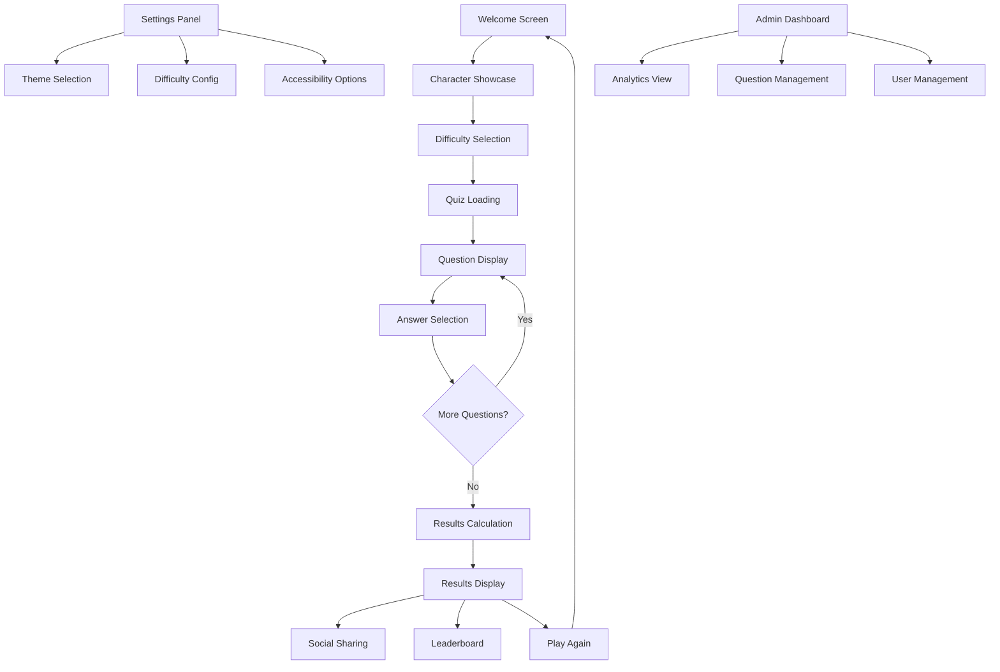

# Marvel Quiz Enhancement Plan: From Prototype to Portfolio Flagship

## 1. Project Overview

Transform the existing functional Marvel Quiz from a basic HTML/JavaScript implementation into a modern, professional React + TypeScript application that serves as a flagship portfolio piece. This enhancement will demonstrate advanced frontend development skills, API integration capabilities, and modern web development best practices.

**Current State**: Functional HTML/CSS/JavaScript quiz with static questions and basic interactivity
**Target State**: Professional React + TypeScript application with Marvel API integration, animations, and enterprise-level architecture

## 2. Core Enhancement Features

### 2.1 Technology Stack Upgrade

| Component | Current | Enhanced |
|-----------|---------|----------|
| Frontend Framework | Vanilla HTML/JS | React 18 + TypeScript |
| Build Tool | None | Vite |
| Styling | Custom CSS | Tailwind CSS + Custom Properties |
| Animations | Basic CSS | Framer Motion |
| API Integration | None | Marvel API with fallback system |
| State Management | DOM manipulation | React Context + Hooks |
| Deployment | Static files | GitHub Pages with CI/CD |

### 2.2 Feature Enhancement Modules

Our enhanced Marvel Quiz will consist of the following main components:

1. **Welcome Screen**: Hero section with animated particle effects, character showcase carousel, difficulty selection
2. **Quiz Engine**: Dynamic question generation from Marvel API, real-time scoring, progress tracking, timer system
3. **Character Integration**: Live character data, dynamic portraits, character-specific backgrounds
4. **Results Dashboard**: Animated score display, performance analytics, social sharing, leaderboard integration
5. **Settings Panel**: Difficulty customization, accessibility options, theme selection
6. **Admin Panel**: Question management, analytics dashboard, user engagement metrics

### 2.3 Page Details

| Page Name | Module Name | Feature Description |
|-----------|-------------|--------------------|
| Welcome Screen | Hero Section | Animated particle background, character carousel with Framer Motion, difficulty selection with visual previews |
| Welcome Screen | Statistics Panel | User progress tracking, best scores display, achievement badges |
| Quiz Interface | Question Display | Dynamic Marvel API character integration, image preloading, responsive layouts |
| Quiz Interface | Answer System | Animated option selection, real-time feedback, score calculation with bonuses |
| Quiz Interface | Progress Tracking | Animated progress bar, question counter, time remaining with visual alerts |
| Results Screen | Score Analytics | Animated counters, performance breakdown, comparison with previous attempts |
| Results Screen | Social Features | Share functionality, leaderboard integration, achievement unlocking |
| Settings Panel | Customization | Theme selection, difficulty adjustment, accessibility options |
| Admin Dashboard | Analytics | User engagement metrics, question performance analysis, API usage monitoring |

## 3. Core Process Flow

### 3.1 User Journey Flow

**Standard User Flow:**
1. User lands on animated welcome screen with particle effects
2. Character carousel showcases Marvel heroes with smooth transitions
3. User selects difficulty level with visual feedback
4. Quiz begins with Marvel API-powered questions
5. Real-time scoring and progress tracking throughout
6. Results screen displays animated performance analytics
7. Social sharing and leaderboard integration
8. Option to restart or adjust settings

**Admin Flow:**
1. Admin accesses dashboard through secure authentication
2. Views comprehensive analytics and user engagement metrics
3. Manages question pools and difficulty settings
4. Monitors Marvel API usage and performance
5. Configures leaderboard and achievement systems

### 3.2 Application Flow Diagram

## 4. User Interface Design

### 4.1 Design Style

**Visual Theme**: Modern glassmorphism with Marvel-inspired elements
- **Primary Colors**: 
  - Marvel Red: `#ED1D24`
  - Deep Blue: `#1E3A8A`
  - Gold Accent: `#FFD700`
- **Secondary Colors**:
  - Glass Background: `rgba(255, 255, 255, 0.1)`
  - Dark Overlay: `rgba(0, 0, 0, 0.8)`
  - Success Green: `#10B981`
  - Warning Orange: `#F59E0B`

**Typography**:
- Primary Font: `'Inter', sans-serif` (16px base)
- Heading Font: `'Poppins', sans-serif` (24px-48px)
- Code Font: `'JetBrains Mono', monospace`

**Interactive Elements**:
- Button Style: Glassmorphism with hover animations
- Card Style: Elevated glass panels with subtle shadows
- Animation Style: Smooth Framer Motion transitions (0.3s ease-in-out)

**Layout Approach**:
- Mobile-first responsive design
- CSS Grid and Flexbox for layouts
- Component-based architecture
- Accessibility-first design principles

### 4.2 Page Design Overview

| Page Name | Module Name | UI Elements |
|-----------|-------------|-------------|
| Welcome Screen | Hero Section | Full-screen particle background, animated Marvel logo, glassmorphism welcome card with call-to-action |
| Welcome Screen | Character Carousel | Horizontal scrolling character cards with hover effects, smooth transitions, character stats overlay |
| Quiz Interface | Question Panel | Centered glass card with character image, question text with typewriter effect, animated progress indicators |
| Quiz Interface | Answer Options | Grid layout with glassmorphism buttons, hover animations, selection feedback with color coding |
| Results Screen | Analytics Dashboard | Animated score counters, circular progress indicators, achievement badges with unlock animations |
| Settings Panel | Configuration | Tabbed interface with glassmorphism panels, toggle switches, slider controls with real-time previews |

### 4.3 Responsiveness

**Design Approach**: Mobile-first with progressive enhancement
- **Mobile (320px-768px)**: Single-column layout, touch-optimized interactions, simplified animations
- **Tablet (768px-1024px)**: Two-column layout, enhanced hover states, medium complexity animations
- **Desktop (1024px+)**: Multi-column layout, full animation suite, advanced particle effects

**Touch Optimization**: All interactive elements sized for 44px minimum touch targets, swipe gestures for navigation, haptic feedback simulation

**Performance Considerations**: Lazy loading for images, code splitting for components, optimized animations for 60fps performance

## 5. Technical Implementation Strategy

### 5.1 Migration Approach

**Phase 1: Foundation Setup (Week 1)**
- Initialize Vite + React + TypeScript project structure
- Configure Tailwind CSS and development environment
- Set up Marvel API integration with authentication
- Implement basic component architecture

**Phase 2: Core Features (Week 2)**
- Develop quiz engine with React Context state management
- Integrate Marvel API with smart fallback system
- Implement Framer Motion animations and transitions
- Create responsive component library

**Phase 3: Enhancement & Polish (Week 3)**
- Add advanced features (leaderboard, social sharing)
- Implement comprehensive error handling and loading states
- Optimize performance and accessibility
- Deploy with GitHub Pages CI/CD pipeline

### 5.2 Risk Mitigation

**API Dependency Risk**: Implement comprehensive fallback system with static character data
**Performance Risk**: Use React.memo, useMemo, and lazy loading for optimization
**Browser Compatibility Risk**: Progressive enhancement with feature detection
**Deployment Risk**: Automated testing and staging environment validation

### 5.3 Success Metrics

**Technical Metrics**:
- Lighthouse Performance Score: >90
- First Contentful Paint: <2s
- Time to Interactive: <3s
- Accessibility Score: 100

**User Experience Metrics**:
- Quiz completion rate: >80%
- Average session duration: >5 minutes
- Return user rate: >30%
- Social sharing engagement: >10%

This enhancement plan transforms the Marvel Quiz from a functional prototype into a professional portfolio showcase that demonstrates modern web development expertise, API integration skills, and user experience design capabilities.