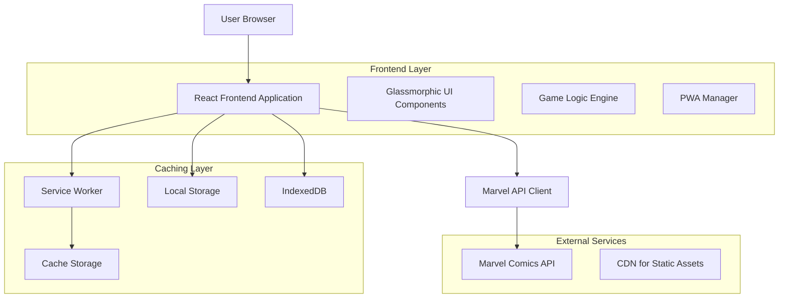
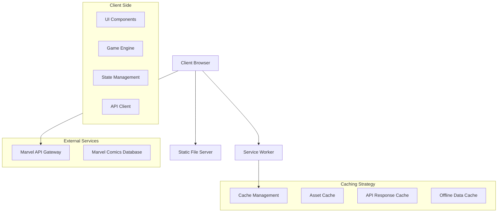
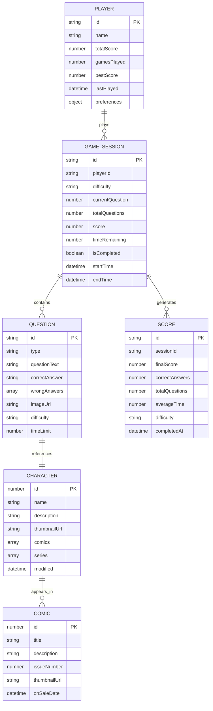

# Marvel Quiz Technical Architecture Document

## 1. Architecture Design



## 2. Technology Description

- **Frontend**: Vanilla JavaScript ES6+ + CSS3 + HTML5
- **Styling**: CSS Grid + Flexbox + CSS Custom Properties + Glassmorphism
- **PWA**: Service Worker + Web App Manifest + Cache API
- **API Integration**: Marvel Comics API with MD5 authentication
- **Storage**: LocalStorage + IndexedDB for offline data
- **Performance**: Intersection Observer + Lazy Loading + Code Splitting

## 3. Route Definitions

| Route | Purpose |
|-------|----------|
| / | Home page with difficulty selection and game start |
| /game | Main quiz interface with questions and scoring |
| /results | Score display and performance analytics |
| /leaderboard | High scores and achievements display |
| /settings | Game preferences and API configuration |
| /offline | Offline mode with cached questions |

## 4. API Definitions

### 4.1 Marvel Comics API Integration

**Character Data Retrieval**
```
GET https://gateway.marvel.com/v1/public/characters
```

Request Parameters:
| Param Name | Param Type | isRequired | Description |
|------------|------------|------------|--------------|
| ts | string | true | Timestamp for authentication |
| apikey | string | true | Public API key |
| hash | string | true | MD5 hash of ts+privateKey+publicKey |
| limit | number | false | Number of results (default: 20) |
| offset | number | false | Skip the specified number of results |
| nameStartsWith | string | false | Filter by character name |

Response:
| Param Name | Param Type | Description |
|------------|------------|-------------|
| data.results | array | Array of character objects |
| data.total | number | Total available characters |
| status | string | Response status |

Example Response:
```json
{
  "data": {
    "results": [
      {
        "id": 1011334,
        "name": "3-D Man",
        "description": "...",
        "thumbnail": {
          "path": "http://i.annihil.us/u/prod/marvel/i/mg/c/e0/535fecbbb9784",
          "extension": "jpg"
        }
      }
    ]
  }
}
```

**Comics Data Retrieval**
```
GET https://gateway.marvel.com/v1/public/comics
```

Request Parameters:
| Param Name | Param Type | isRequired | Description |
|------------|------------|------------|--------------|
| ts | string | true | Timestamp for authentication |
| apikey | string | true | Public API key |
| hash | string | true | MD5 hash authentication |
| characters | number | false | Filter by character ID |
| startYear | number | false | Filter by publication year |

### 4.2 Local Storage API

**Game State Management**
```javascript
// Save game progress
localStorage.setItem('marvelQuiz_gameState', JSON.stringify(gameState));

// Load game progress
const gameState = JSON.parse(localStorage.getItem('marvelQuiz_gameState'));
```

**High Scores Storage**
```javascript
// Save high score
const scores = JSON.parse(localStorage.getItem('marvelQuiz_highScores') || '[]');
scores.push(newScore);
localStorage.setItem('marvelQuiz_highScores', JSON.stringify(scores));
```

## 5. Server Architecture Diagram



## 6. Data Model

### 6.1 Data Model Definition



### 6.2 Data Definition Language

**Local Storage Schema**

```javascript
// Game Session Storage
const gameSessionSchema = {
  id: 'string', // UUID
  playerId: 'string',
  difficulty: 'easy|medium|hard',
  currentQuestion: 'number',
  totalQuestions: 'number',
  score: 'number',
  timeRemaining: 'number',
  isCompleted: 'boolean',
  startTime: 'ISO8601 string',
  endTime: 'ISO8601 string',
  questions: 'array<Question>'
};

// Question Schema
const questionSchema = {
  id: 'string',
  type: 'character_image|real_name|first_appearance|powers|team_affiliation',
  questionText: 'string',
  correctAnswer: 'string',
  wrongAnswers: 'array<string>',
  imageUrl: 'string',
  difficulty: 'easy|medium|hard',
  timeLimit: 'number',
  characterId: 'number'
};

// Player Profile Schema
const playerSchema = {
  id: 'string',
  name: 'string',
  totalScore: 'number',
  gamesPlayed: 'number',
  bestScore: 'number',
  lastPlayed: 'ISO8601 string',
  preferences: {
    difficulty: 'string',
    soundEnabled: 'boolean',
    animationsEnabled: 'boolean',
    theme: 'string'
  },
  achievements: 'array<string>'
};

// High Scores Schema
const highScoreSchema = {
  id: 'string',
  playerName: 'string',
  score: 'number',
  difficulty: 'string',
  questionsCorrect: 'number',
  totalQuestions: 'number',
  averageTime: 'number',
  completedAt: 'ISO8601 string'
};
```

**IndexedDB Schema for Offline Data**

```javascript
// Database initialization
const dbSchema = {
  name: 'MarvelQuizDB',
  version: 1,
  stores: [
    {
      name: 'characters',
      keyPath: 'id',
      indexes: [
        { name: 'name', keyPath: 'name', unique: false },
        { name: 'modified', keyPath: 'modified', unique: false }
      ]
    },
    {
      name: 'comics',
      keyPath: 'id',
      indexes: [
        { name: 'title', keyPath: 'title', unique: false },
        { name: 'onSaleDate', keyPath: 'onSaleDate', unique: false }
      ]
    },
    {
      name: 'gameHistory',
      keyPath: 'id',
      indexes: [
        { name: 'completedAt', keyPath: 'completedAt', unique: false },
        { name: 'score', keyPath: 'score', unique: false }
      ]
    }
  ]
};

// Sample data insertion
const sampleCharacterData = {
  id: 1011334,
  name: '3-D Man',
  description: 'Charles Chandler is a former athlete...',
  thumbnailUrl: 'http://i.annihil.us/u/prod/marvel/i/mg/c/e0/535fecbbb9784.jpg',
  comics: [1234, 5678],
  series: [9012],
  modified: '2023-01-15T10:30:00Z',
  cached_at: Date.now()
};

// Cache management
const cacheConfig = {
  maxAge: 24 * 60 * 60 * 1000, // 24 hours
  maxEntries: 1000,
  strategy: 'cache-first-with-refresh'
};
```

**Service Worker Cache Strategy**

```javascript
// Cache configuration
const CACHE_CONFIG = {
  STATIC_CACHE: 'marvel-quiz-static-v1',
  DYNAMIC_CACHE: 'marvel-quiz-dynamic-v1',
  API_CACHE: 'marvel-quiz-api-v1',
  IMAGE_CACHE: 'marvel-quiz-images-v1'
};

// Cache strategies
const cacheStrategies = {
  static: 'cache-first',
  api: 'network-first-with-cache-fallback',
  images: 'cache-first-with-network-fallback',
  dynamic: 'stale-while-revalidate'
};

// Cache initialization
const urlsToCache = [
  '/',
  '/index.html',
  '/assets/css/main.css',
  '/assets/css/glassmorphism.css',
  '/assets/js/app.js',
  '/assets/js/game-logic.js',
  '/assets/js/marvel-api.js',
  '/assets/data/fallback-characters.json',
  '/assets/images/placeholder-character.jpg'
];
```