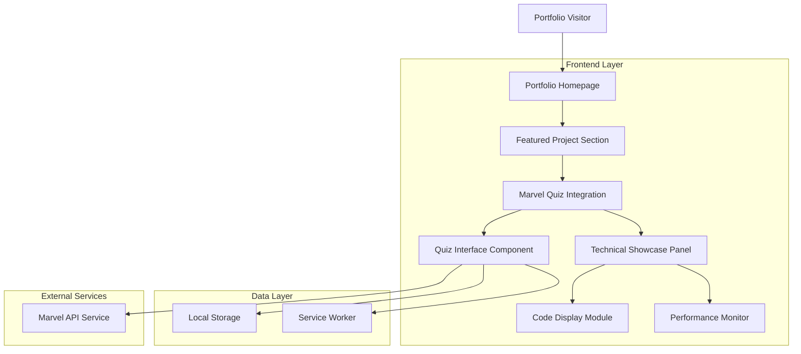
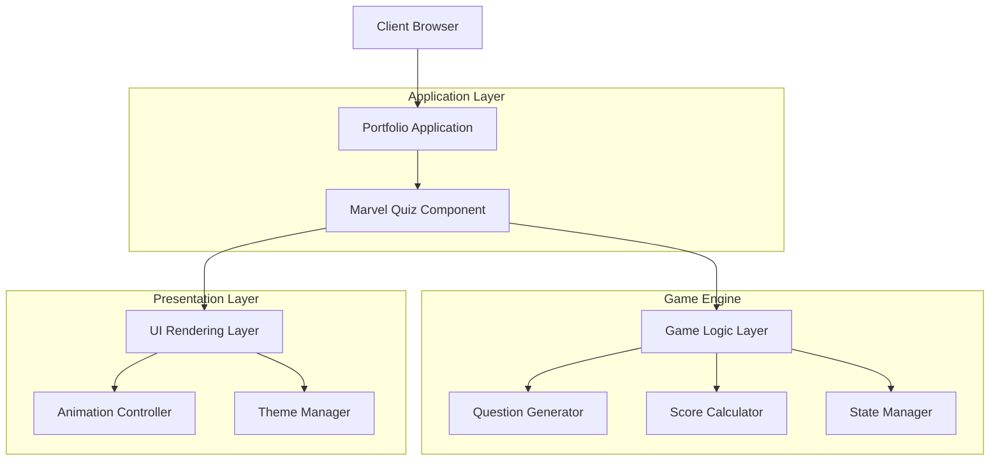
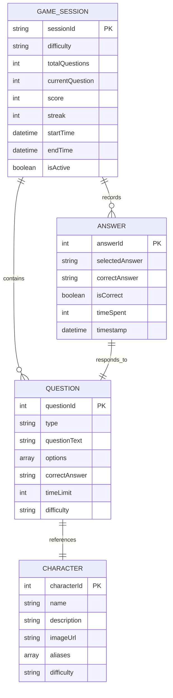

# Marvel Quiz Game - Technical Architecture Document

## 1. Architecture Design



## 2. Technology Description

* **Frontend**: Vanilla JavaScript ES6+ + CSS3 Glassmorphism + HTML5 PWA

* **API Integration**: Marvel Comics API with fallback data system

* **Storage**: LocalStorage for game state + Service Worker for offline capability

* **Build Tool**: Vite for development and optimization

* **Styling**: Custom CSS with glassmorphic design system and responsive utilities

## 3. Route Definitions

| Route                           | Purpose                                                      |
| ------------------------------- | ------------------------------------------------------------ |
| /index.html                     | Main portfolio homepage with integrated Marvel Quiz showcase |
| /marvel-quiz-game/index.html    | Standalone Marvel Quiz application (embedded in portfolio)   |
| /marvel-quiz-game/manifest.json | PWA manifest for installable app features                    |
| /marvel-quiz-game/sw\.js        | Service worker for offline functionality and caching         |

## 4. API Definitions

### 4.1 Core API Integration

**Marvel Comics API Integration**

```
GET https://gateway.marvel.com/v1/public/characters
```

Request Parameters:

| Param Name | Param Type | isRequired | Description                              |
| ---------- | ---------- | ---------- | ---------------------------------------- |
| apikey     | string     | true       | Marvel API public key                    |
| ts         | string     | true       | Timestamp for authentication             |
| hash       | string     | true       | MD5 hash of ts+privateKey+publicKey      |
| limit      | number     | false      | Number of results to fetch (default: 20) |
| offset     | number     | false      | Skip the specified number of resources   |

Response Structure:

| Param Name                  | Param Type | Description                       |
| --------------------------- | ---------- | --------------------------------- |
| data.results                | array      | Array of Marvel character objects |
| data.results\[].name        | string     | Character name                    |
| data.results\[].description | string     | Character description             |
| data.results\[].thumbnail   | object     | Character image URLs              |

**Local Fallback Data Structure**

```json
{
  "characters": [
    {
      "id": 1,
      "name": "Spider-Man",
      "description": "Friendly neighborhood Spider-Man",
      "thumbnail": {
        "path": "assets/images/spiderman",
        "extension": "jpg"
      },
      "difficulty": "easy"
    }
  ]
}
```

### 4.2 Game State Management API

**Local Storage Schema**

```javascript
// Game state structure
{
  "gameState": {
    "currentScreen": "home|game|results",
    "difficulty": "easy|medium|hard",
    "currentQuestion": 0,
    "totalQuestions": 10,
    "score": 0,
    "streak": 0,
    "questions": [],
    "answers": [],
    "isGameActive": false
  },
  "userPreferences": {
    "preferredDifficulty": "medium",
    "soundEnabled": false,
    "animationsEnabled": true
  },
  "statistics": {
    "gamesPlayed": 0,
    "totalScore": 0,
    "bestStreak": 0,
    "averageAccuracy": 0
  }
}
```

## 5. Server Architecture Diagram



## 6. Data Model

### 6.1 Data Model Definition



### 6.2 Data Definition Language

**LocalStorage Schema Implementation**

```javascript
// Initialize game data structure
const initializeGameData = () => {
    const defaultData = {
        gameState: {
            currentScreen: 'home',
            difficulty: 'medium',
            currentQuestion: 0,
            totalQuestions: 10,
            score: 0,
            timeRemaining: 30,
            streak: 0,
            maxStreak: 0,
            startTime: null,
            endTime: null,
            questions: [],
            answers: [],
            isGameActive: false,
            isPaused: false
        },
        userPreferences: {
            preferredDifficulty: 'medium',
            soundEnabled: false,
            animationsEnabled: true,
            theme: 'glassmorphic'
        },
        statistics: {
            gamesPlayed: 0,
            totalScore: 0,
            bestStreak: 0,
            averageAccuracy: 0,
            totalTimeSpent: 0,
            favoriteCharacters: []
        }
    };
    
    localStorage.setItem('marvelQuizData', JSON.stringify(defaultData));
    return defaultData;
};

// Fallback character data structure
const fallbackCharacters = [
    {
        id: 1009610,
        name: "Spider-Man",
        description: "Bitten by a radioactive spider, Peter Parker's spider abilities give him amazing powers he uses to help others.",
        thumbnail: {
            path: "assets/images/characters/spiderman",
            extension: "jpg"
        },
        difficulty: "easy",
        aliases: ["Peter Parker", "Web-Slinger", "Wall-Crawler"]
    },
    {
        id: 1009368,
        name: "Iron Man",
        description: "Wounded, captured and forced to build a weapon by his enemies, billionaire industrialist Tony Stark instead created an advanced suit of armor to save his life and escape captivity.",
        thumbnail: {
            path: "assets/images/characters/ironman",
            extension: "jpg"
        },
        difficulty: "medium",
        aliases: ["Tony Stark", "Armored Avenger"]
    }
];

// Service Worker Cache Configuration
const CACHE_NAME = 'marvel-quiz-v1';
const urlsToCache = [
    '/marvel-quiz-game/',
    '/marvel-quiz-game/index.html',
    '/marvel-quiz-game/assets/css/main.css',
    '/marvel-quiz-game/assets/css/glassmorphism.css',
    '/marvel-quiz-game/assets/js/app.js',
    '/marvel-quiz-game/assets/js/marvel-api.js',
    '/marvel-quiz-game/assets/data/fallback.json',
    '/marvel-quiz-game/manifest.json'
];
```

