# Marvel Quiz Technical Architecture: Modern React Implementation

## 1. Architecture Design


## 2. Technology Description

**Frontend Stack:**
- React@18 + TypeScript@5 + Vite@5
- Tailwind CSS@3 + PostCSS@8
- Framer Motion@11 for animations
- Lucide React@0.263 for icons
- React Router@6 for navigation

**Development Tools:**
- ESLint@8 + Prettier@3 for code quality
- Vitest@1 for unit testing
- Playwright@1 for E2E testing
- Husky@8 for git hooks

**API Integration:**
- Marvel API with crypto-js@4 for authentication
- Axios@1 for HTTP requests
- React Query@4 for data fetching and caching

**Deployment:**
- GitHub Pages with GitHub Actions CI/CD
- Vite build optimization
- Service Worker for offline functionality

## 3. Route Definitions

| Route | Purpose | Component | Features |
|-------|---------|-----------|----------|
| `/` | Landing page with hero section and character showcase | `HomePage` | Particle animations, character carousel, difficulty selection |
| `/quiz` | Main quiz interface with dynamic questions | `QuizPage` | Marvel API integration, real-time scoring, progress tracking |
| `/quiz/:difficulty` | Quiz with specific difficulty level | `QuizPage` | Parameterized difficulty, adaptive question selection |
| `/results` | Results dashboard with analytics | `ResultsPage` | Animated score display, performance metrics, social sharing |
| `/leaderboard` | Global and personal leaderboards | `LeaderboardPage` | Score rankings, achievement badges, filtering options |
| `/settings` | User preferences and accessibility options | `SettingsPage` | Theme selection, difficulty customization, accessibility controls |
| `/about` | Information about the quiz and Marvel API | `AboutPage` | API documentation, developer information, attribution |
| `/404` | Error page for invalid routes | `NotFoundPage` | Animated error message, navigation back to home |

## 4. API Definitions

### 4.1 Marvel API Integration

**Authentication Service**
```typescript
interface MarvelAuthParams {
  ts: string;
  apikey: string;
  hash: string;
}

class MarvelAuthService {
  generateAuthParams(): MarvelAuthParams;
  validateApiKeys(): boolean;
}
```

**Character Service**
```typescript
interface MarvelCharacter {
  id: number;
  name: string;
  description: string;
  thumbnail: {
    path: string;
    extension: string;
  };
  comics: { available: number };
  series: { available: number };
  events: { available: number };
}

class CharacterService {
  async getCharacters(limit?: number, offset?: number): Promise<MarvelCharacter[]>;
  async getRandomCharacters(count?: number): Promise<MarvelCharacter[]>;
  async searchCharacters(nameStartsWith: string): Promise<MarvelCharacter[]>;
  async getCharacterById(id: number): Promise<MarvelCharacter | null>;
}
```

### 4.2 Quiz Engine API

**Question Generation**
```typescript
interface QuizQuestion {
  id: string;
  type: 'character-name' | 'character-description' | 'character-stats' | 'character-appearance';
  difficulty: 'easy' | 'medium' | 'hard';
  question: string;
  options: string[];
  correctAnswer: number;
  character: MarvelCharacter;
  timeLimit: number;
  points: number;
}

class QuizEngine {
  async generateQuestions(difficulty: string, count: number): Promise<QuizQuestion[]>;
  calculateScore(answers: UserAnswer[], timeSpent: number[]): QuizResult;
  validateAnswer(questionId: string, answerIndex: number): boolean;
}
```

**Score Management**
```typescript
interface QuizResult {
  score: number;
  totalQuestions: number;
  correctAnswers: number;
  accuracy: number;
  totalTime: number;
  averageTime: number;
  difficulty: string;
  timestamp: Date;
  achievements: Achievement[];
}

class ScoreService {
  saveScore(result: QuizResult): void;
  getPersonalBest(difficulty?: string): QuizResult | null;
  getLeaderboard(difficulty?: string, limit?: number): QuizResult[];
  calculateRank(score: number, difficulty: string): number;
}
```

### 4.3 Cache Management API

**Character Cache**
```typescript
interface CacheEntry<T> {
  data: T;
  timestamp: number;
  expiry: number;
}

class CacheService {
  set<T>(key: string, data: T, ttl?: number): void;
  get<T>(key: string): T | null;
  invalidate(key: string): void;
  clear(): void;
  isExpired(key: string): boolean;
}
```

## 5. Component Architecture

### 5.1 Component Hierarchy


### 5.2 State Management Architecture

```typescript
// Global Application State
interface AppState {
  user: UserState;
  quiz: QuizState;
  ui: UIState;
  cache: CacheState;
}

// Quiz State Management
interface QuizState {
  currentQuestion: number;
  questions: QuizQuestion[];
  answers: UserAnswer[];
  score: number;
  timeRemaining: number;
  isActive: boolean;
  difficulty: string;
}

// UI State Management
interface UIState {
  theme: 'light' | 'dark' | 'auto';
  animations: boolean;
  soundEffects: boolean;
  accessibility: AccessibilitySettings;
  loading: LoadingState;
}
```

## 6. Data Model

### 6.1 Data Model Definition

```mermaid
erDiagram
    USER ||--o{ QUIZ_RESULT : completes
    USER ||--o{ USER_SETTINGS : configures
    QUIZ_RESULT ||--|| QUIZ_SESSION : belongs_to
    QUIZ_SESSION ||--o{ QUESTION_ANSWER : contains
    MARVEL_CHARACTER ||--o{ QUIZ_QUESTION : featured_in
    ACHIEVEMENT ||--o{ USER_ACHIEVEMENT : earned_by
    
    USER {
        string id PK
        string username
        date created_at
        date last_active
        int total_quizzes
        int best_score
    }
    
    QUIZ_RESULT {
        string id PK
        string user_id FK
        int score
        int total_questions
        int correct_answers
        float accuracy
        int total_time
        string difficulty
        date completed_at
    }
    
    QUIZ_SESSION {
        string id PK
        string result_id FK
        date started_at
        date completed_at
        string difficulty
        boolean completed
    }
    
    QUESTION_ANSWER {
        string id PK
        string session_id FK
        string question_id
        int selected_answer
        int correct_answer
        boolean is_correct
        int time_spent
        date answered_at
    }
    
    MARVEL_CHARACTER {
        int id PK
        string name
        string description
        string thumbnail_url
        int comics_count
        int series_count
        date last_updated
    }
    
    QUIZ_QUESTION {
        string id PK
        int character_id FK
        string type
        string difficulty
        string question_text
        json options
        int correct_answer
        int time_limit
        int points
    }
    
    ACHIEVEMENT {
        string id PK
        string name
        string description
        string icon
        string criteria
        int points
    }
    
    USER_ACHIEVEMENT {
        string id PK
        string user_id FK
        string achievement_id FK
        date earned_at
    }
    
    USER_SETTINGS {
        string id PK
        string user_id FK
        string theme
        boolean animations
        boolean sound_effects
        json accessibility_options
        date updated_at
    }
```



### 6.2 Local Storage Schema

**User Data Storage**
```typescript
// localStorage keys and structure
const STORAGE_KEYS = {
  USER_PROFILE: 'marvel_quiz_user',
  QUIZ_RESULTS: 'marvel_quiz_results',
  USER_SETTINGS: 'marvel_quiz_settings',
  CHARACTER_CACHE: 'marvel_quiz_characters',
  ACHIEVEMENTS: 'marvel_quiz_achievements'
} as const;

// User Profile Storage
interface StoredUserProfile {
  id: string;
  username: string;
  createdAt: string;
  totalQuizzes: number;
  bestScores: Record<string, number>; // difficulty -> best score
  achievements: string[]; // achievement IDs
}

// Quiz Results Storage
interface StoredQuizResults {
  results: QuizResult[];
  lastUpdated: string;
}

// Settings Storage
interface StoredSettings {
  theme: 'light' | 'dark' | 'auto';
  animations: boolean;
  soundEffects: boolean;
  difficulty: 'easy' | 'medium' | 'hard';
  accessibility: {
    reducedMotion: boolean;
    highContrast: boolean;
    fontSize: 'small' | 'medium' | 'large';
  };
}

// Character Cache Storage
interface StoredCharacterCache {
  characters: Record<string, CacheEntry<MarvelCharacter>>;
  lastCleanup: string;
}
```

### 6.3 Session Storage Schema

**Active Quiz Session**
```typescript
// sessionStorage for current quiz state
interface ActiveQuizSession {
  sessionId: string;
  startedAt: string;
  difficulty: string;
  questions: QuizQuestion[];
  currentQuestion: number;
  answers: UserAnswer[];
  timeRemaining: number;
  score: number;
}

// Temporary UI State
interface SessionUIState {
  lastRoute: string;
  scrollPositions: Record<string, number>;
  formData: Record<string, any>;
}
```

## 7. Performance Optimization Strategy

### 7.1 Code Splitting
- Route-based code splitting with React.lazy()
- Component-level splitting for heavy features
- Dynamic imports for Marvel API service

### 7.2 Caching Strategy
- Marvel API responses cached for 5 minutes
- Character images preloaded and cached
- Service Worker for offline functionality

### 7.3 Bundle Optimization
- Tree shaking for unused code elimination
- Image optimization with WebP format
- CSS purging with Tailwind CSS

### 7.4 Runtime Performance
- React.memo for expensive components
- useMemo for complex calculations
- useCallback for event handlers
- Virtual scrolling for large character lists

This technical architecture provides a robust foundation for transforming the Marvel Quiz into a professional, scalable, and maintainable React application that