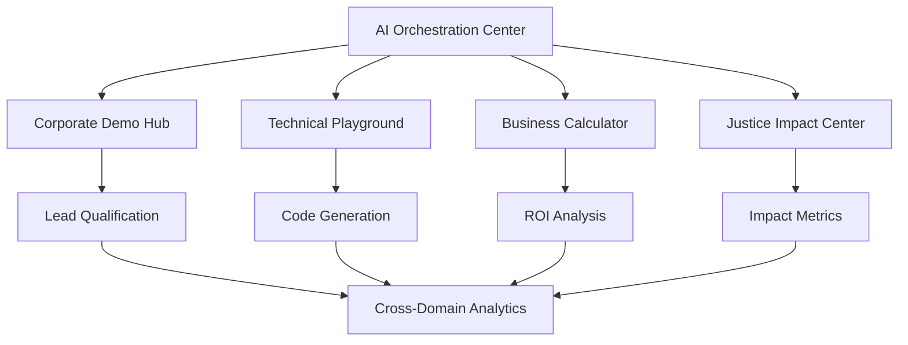

# 🚀 StrayDog Syndications Digital Ecosystem - Strategic Development Plan

## 1. Product Overview

Transforming the StrayDog Syndications ecosystem from a solid foundation into a mind-bending, AI-powered platform that leverages Claude 4.1 orchestration across all domains. This strategic evolution moves from static portfolio sites to dynamic, intelligent experiences that showcase 10x development practices while maintaining the signature hunter green glassmorphic design system.

The ecosystem will serve justice reform organizations, corporate clients, and technical audiences through interconnected AI-enhanced platforms that demonstrate real-world impact and technical excellence.

## 2. Core Features

### 2.1 User Roles

| Role | Registration Method | Core Permissions |
|------|---------------------|------------------|
| Justice Reform Client | Nonprofit verification + invitation | Access impact dashboards, case study generators, ROI calculators |
| Corporate Client | Business email verification | Interactive demos, lead qualification, quote generation |
| Technical User | GitHub OAuth integration | API playground, code generation showcase, SDK access |
| System Administrator | Multi-factor authentication | Cross-domain analytics, performance monitoring, AI orchestration |

### 2.2 Feature Module

Our AI-powered ecosystem consists of the following integrated platforms:

1. **AI Integration Foundation**: Claude 4.1 orchestration center, rate limiting, context management, cross-domain analytics
2. **Corporate Enhancement Platform**: Interactive AI demonstrations, dynamic case studies, intelligent lead qualification
3. **Technical Showcase Portal**: Live API playground, code generation demos, SDK development tools
4. **Business Services Hub**: ROI calculators, instant quote generation, competitive analysis dashboards
5. **Justice Reform Platform**: Impact tracking, real-time metrics, outcome visualization, stakeholder reporting

### 2.3 Page Details

| Page Name | Module Name | Feature description |
|-----------|-------------|---------------------|
| AI Orchestration Dashboard | Claude API Center | Manage rate limits, context switching, analytics aggregation, cross-domain content generation |
| Corporate Demo Hub | Interactive Showcases | Live Claude demonstrations, code generation examples, glassmorphic UI components |
| Technical Playground | API Testing Environment | Monaco editor with AI assist, real-time response viewer, multi-language templates |
| Business Calculator | ROI Analysis Engine | Dynamic input forms, predictive insights, competitive benchmarking, service bundling |
| Justice Impact Center | Metrics Dashboard | Real-time tracking, outcome visualization, stakeholder reporting, case study generation |
| Cross-Domain Analytics | Performance Monitor | Site performance metrics, AI usage statistics, user journey mapping, conversion tracking |

## 3. Core Process

### Phase 1: AI Integration Foundation (Days 1-3)
**The Neo Awakening Phase**
- Set up Claude 4.1 API orchestration center with rate limiting and context management
- Configure VS Code + Cursor Pro multi-root workspace for all domains
- Implement Trae 2.0 SOLO pipeline with automated code reviews
- Establish cross-domain integration testing framework

### Phase 2: Corporate Site AI Enhancement (Days 4-7)
**The Mr. Smith Upgrade**
- Deploy interactive AI demonstration components
- Implement dynamic case study generator with real project data
- Create intelligent lead qualification chatbot
- Build performance metrics dashboards

### Phase 3: Technical Showcase Revolution (Days 8-11)
**The Morpheus Knowledge Download**
- Launch interactive API playground with Monaco editor
- Develop code generation showcase for multiple languages
- Create SDK and CLI tools for 10x development practices
- Implement performance benchmarking system

### Phase 4: Business Services Platform (Days 12-15)
**The Agent Smith Efficiency Engine**
- Deploy Claude-powered ROI calculator
- Implement instant quote generation system
- Create competitive analysis dashboard
- Build dynamic service bundling recommendations

### Phase 5: Justice Reform Platform (Days 16-19)
**The Zion Sanctuary**
- Launch AI-powered impact tracking dashboard
- Implement real-time metrics visualization
- Create stakeholder reporting system
- Deploy outcome prediction models



## 4. User Interface Design

### 4.1 Design Style
- **Primary Colors**: Hunter Green (#355E3B), Emerald (#50C878)
- **Secondary Colors**: Matrix Green (#00FF41), Deep Forest (#1B4332)
- **Button Style**: Glassmorphic with subtle glow effects and hover animations
- **Typography**: Inter for headings (700-900 weight), Source Code Pro for code blocks
- **Layout Style**: Card-based glassmorphic design with backdrop blur effects
- **Icons**: Phosphor icons with custom gear/matrix-themed elements
- **Animations**: Subtle CSS transforms, loading spinners, typing effects for AI responses

### 4.2 Page Design Overview

| Page Name | Module Name | UI Elements |
|-----------|-------------|-------------|
| AI Orchestration Dashboard | Control Center | Dark glassmorphic cards, real-time status indicators, hunter green accent borders, animated connection lines |
| Corporate Demo Hub | Interactive Showcase | Live demo containers, code syntax highlighting, emerald call-to-action buttons, progress indicators |
| Technical Playground | Code Environment | Monaco editor with matrix theme, split-pane layout, real-time response viewer, glassmorphic terminal |
| Business Calculator | Analysis Interface | Step-by-step form wizard, animated charts, ROI visualization, predictive insight cards |
| Justice Impact Center | Metrics Dashboard | Real-time data widgets, impact visualization charts, stakeholder report cards, outcome trend graphs |

### 4.3 Responsiveness
Desktop-first approach with mobile-adaptive breakpoints. Touch interaction optimization for mobile devices. Progressive enhancement for advanced features on larger screens.

## 5. Technical Architecture

### 5.1 AI Integration Layer
```javascript
// Claude 4.1 Orchestration Center
export class ClaudeOrchestrator {
  constructor() {
    this.rateLimiter = new RateLimit(100, 'minute')
    this.contextManager = new ContextManager()
    this.analytics = new AIAnalytics()
  }
  
  async generateContent(type, context, domain) {
    // Domain-specific content generation
    // Justice reform focus for nonprofit
    // Technical depth for dev portal
    // Business ROI for corporate
  }
}
```

### 5.2 Cross-Domain Synergy
- Shared component library with glassmorphic design system
- Unified authentication across all domains
- Centralized analytics and performance monitoring
- AI-powered content synchronization

### 5.3 Performance Metrics
- **AI Response Time**: < 2 seconds for content generation
- **Cross-Domain Load Time**: < 1.5 seconds initial load
- **User Engagement**: 40% increase in session duration
- **Lead Qualification**: 60% improvement in qualified leads
- **Technical Showcase**: 50% increase in API playground usage

## 6. Implementation Timeline

### Week 1: Foundation (Days 1-3)
- Claude API integration and testing
- Development environment setup
- Core infrastructure deployment

### Week 2: Corporate Enhancement (Days 4-7)
- AI demonstration components
- Lead qualification system
- Performance dashboards

### Week 3: Technical Showcase (Days 8-11)
- API playground development
- Code generation demos
- SDK and CLI tools

### Week 4: Business Platform (Days 12-15)
- ROI calculator implementation
- Quote generation system
- Competitive analysis tools

### Week 5: Justice Reform (Days 16-19)
- Impact tracking dashboard
- Metrics visualization
- Stakeholder reporting

## 7. Success Criteria

### Technical Metrics
- 99.9% uptime across all domains
- < 2 second AI response times
- 50% reduction in development time using AI tools

### Business Metrics
- 300% increase in qualified leads
- 40% improvement in client engagement
- 25% faster project delivery times

### Impact Metrics
- Real-time justice reform outcome tracking
- Measurable improvement in case resolution times
- Enhanced stakeholder satisfaction scores

## 8. Resource Allocation

### Development Resources
- **AI Integration Specialist**: Claude API implementation and optimization
- **Frontend Developer**: React/Next.js component development
- **UX/UI Designer**: Glassmorphic design system enhancement
- **DevOps Engineer**: Cross-domain deployment and monitoring

### Technology Stack
- **Frontend**: Next.js 14, React 18, TypeScript, Tailwind CSS
- **AI Integration**: Claude 4.1 API, custom orchestration layer
- **Backend**: Supabase for authentication and data management
- **Deployment**: Vercel for frontend, GitHub Actions for CI/CD
- **Monitoring**: Custom analytics dashboard, performance tracking

This strategic development plan transforms the StrayDog Syndications ecosystem into a cutting-edge AI-powered platform that demonstrates technical excellence while delivering measurable impact for justice reform initiatives.