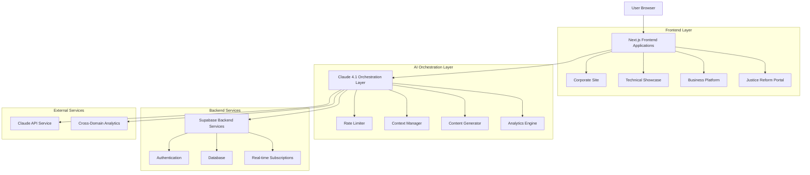
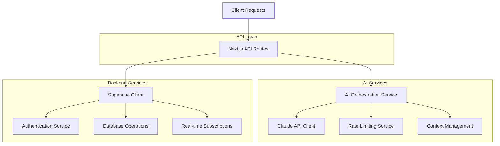
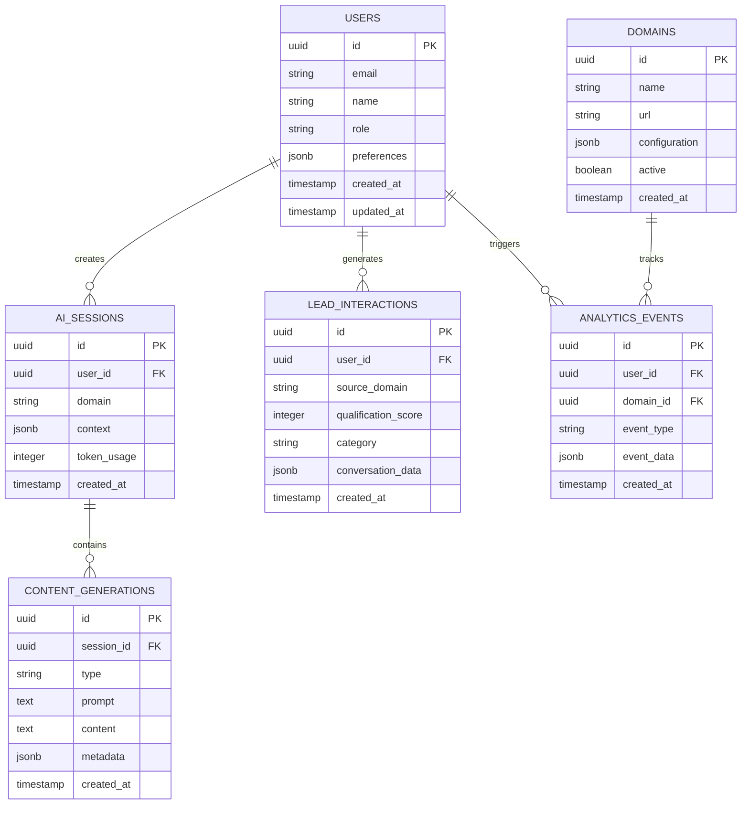

# StrayDog Syndications AI Ecosystem - Technical Architecture

## 1. Architecture Design



## 2. Technology Description

- **Frontend**: Next.js@14 + React@18 + TypeScript + Tailwind CSS + Framer Motion
- **AI Integration**: Claude 4.1 API + Custom Orchestration Layer
- **Backend**: Supabase (PostgreSQL + Auth + Real-time)
- **Development**: Vite + Cursor Pro + Trae 2.0 SOLO
- **Deployment**: Vercel + GitHub Actions
- **Monitoring**: Custom Analytics Dashboard + Performance Tracking

## 3. Route Definitions

| Route | Purpose |
|-------|---------|
| / | Main portfolio landing page with AI-powered dynamic content |
| /corporate | Corporate services hub with interactive AI demonstrations |
| /technical | Technical showcase with API playground and code generation |
| /business | Business services platform with ROI calculators and quotes |
| /justice | Justice reform platform with impact tracking and metrics |
| /playground | Interactive Claude API testing environment |
| /dashboard | Cross-domain analytics and performance monitoring |
| /auth | Unified authentication across all domains |

## 4. API Definitions

### 4.1 Core AI Orchestration API

**Claude Content Generation**
```
POST /api/ai/generate
```

Request:
| Param Name | Param Type | isRequired | Description |
|------------|------------|------------|-------------|
| type | string | true | Content type (case-study, code, analysis, roi) |
| context | object | true | Domain-specific context data |
| domain | string | true | Target domain (corporate, technical, business, justice) |
| userId | string | false | User ID for personalization |

Response:
| Param Name | Param Type | Description |
|------------|------------|-------------|
| content | string | Generated content |
| metadata | object | Generation metadata and analytics |
| usage | object | API usage statistics |

Example:
```json
{
  "type": "case-study",
  "context": {
    "industry": "justice-reform",
    "metrics": ["recidivism", "cost-savings"]
  },
  "domain": "corporate"
}
```

**Real-time Analytics**
```
GET /api/analytics/realtime
```

Request:
| Param Name | Param Type | isRequired | Description |
|------------|------------|------------|-------------|
| domain | string | false | Filter by specific domain |
| timeframe | string | false | Time range (1h, 24h, 7d, 30d) |

Response:
| Param Name | Param Type | Description |
|------------|------------|-------------|
| metrics | object | Real-time performance metrics |
| aiUsage | object | Claude API usage statistics |
| userEngagement | object | Cross-domain user interaction data |

**Lead Qualification**
```
POST /api/business/qualify-lead
```

Request:
| Param Name | Param Type | isRequired | Description |
|------------|------------|------------|-------------|
| message | string | true | User message or inquiry |
| context | object | true | Conversation context |
| source | string | true | Lead source (corporate, business, justice) |

Response:
| Param Name | Param Type | Description |
|------------|------------|-------------|
| score | number | Lead qualification score (0-100) |
| category | string | Lead category classification |
| nextAction | string | Recommended follow-up action |
| insights | array | AI-generated insights about the lead |

## 5. Server Architecture Diagram



## 6. Data Model

### 6.1 Data Model Definition



### 6.2 Data Definition Language

**Users Table**
```sql
-- Create users table
CREATE TABLE users (
    id UUID PRIMARY KEY DEFAULT gen_random_uuid(),
    email VARCHAR(255) UNIQUE NOT NULL,
    name VARCHAR(100) NOT NULL,
    role VARCHAR(50) DEFAULT 'user' CHECK (role IN ('user', 'corporate', 'technical', 'admin')),
    preferences JSONB DEFAULT '{}',
    created_at TIMESTAMP WITH TIME ZONE DEFAULT NOW(),
    updated_at TIMESTAMP WITH TIME ZONE DEFAULT NOW()
);

-- Create indexes
CREATE INDEX idx_users_email ON users(email);
CREATE INDEX idx_users_role ON users(role);
```

**AI Sessions Table**
```sql
-- Create ai_sessions table
CREATE TABLE ai_sessions (
    id UUID PRIMARY KEY DEFAULT gen_random_uuid(),
    user_id UUID REFERENCES users(id) ON DELETE CASCADE,
    domain VARCHAR(50) NOT NULL,
    context JSONB DEFAULT '{}',
    token_usage INTEGER DEFAULT 0,
    created_at TIMESTAMP WITH TIME ZONE DEFAULT NOW()
);

-- Create indexes
CREATE INDEX idx_ai_sessions_user_id ON ai_sessions(user_id);
CREATE INDEX idx_ai_sessions_domain ON ai_sessions(domain);
CREATE INDEX idx_ai_sessions_created_at ON ai_sessions(created_at DESC);
```

**Content Generations Table**
```sql
-- Create content_generations table
CREATE TABLE content_generations (
    id UUID PRIMARY KEY DEFAULT gen_random_uuid(),
    session_id UUID REFERENCES ai_sessions(id) ON DELETE CASCADE,
    type VARCHAR(50) NOT NULL,
    prompt TEXT NOT NULL,
    content TEXT NOT NULL,
    metadata JSONB DEFAULT '{}',
    created_at TIMESTAMP WITH TIME ZONE DEFAULT NOW()
);

-- Create indexes
CREATE INDEX idx_content_generations_session_id ON content_generations(session_id);
CREATE INDEX idx_content_generations_type ON content_generations(type);
CREATE INDEX idx_content_generations_created_at ON content_generations(created_at DESC);
```

**Lead Interactions Table**
```sql
-- Create lead_interactions table
CREATE TABLE lead_interactions (
    id UUID PRIMARY KEY DEFAULT gen_random_uuid(),
    user_id UUID REFERENCES users(id) ON DELETE CASCADE,
    source_domain VARCHAR(50) NOT NULL,
    qualification_score INTEGER CHECK (qualification_score >= 0 AND qualification_score <= 100),
    category VARCHAR(50),
    conversation_data JSONB DEFAULT '{}',
    created_at TIMESTAMP WITH TIME ZONE DEFAULT NOW()
);

-- Create indexes
CREATE INDEX idx_lead_interactions_user_id ON lead_interactions(user_id);
CREATE INDEX idx_lead_interactions_source_domain ON lead_interactions(source_domain);
CREATE INDEX idx_lead_interactions_score ON lead_interactions(qualification_score DESC);
```

**Domains Table**
```sql
-- Create domains table
CREATE TABLE domains (
    id UUID PRIMARY KEY DEFAULT gen_random_uuid(),
    name VARCHAR(100) UNIQUE NOT NULL,
    url VARCHAR(255) NOT NULL,
    configuration JSONB DEFAULT '{}',
    active BOOLEAN DEFAULT true,
    created_at TIMESTAMP WITH TIME ZONE DEFAULT NOW()
);

-- Create indexes
CREATE INDEX idx_domains_name ON domains(name);
CREATE INDEX idx_domains_active ON domains(active);
```

**Analytics Events Table**
```sql
-- Create analytics_events table
CREATE TABLE analytics_events (
    id UUID PRIMARY KEY DEFAULT gen_random_uuid(),
    user_id UUID REFERENCES users(id) ON DELETE SET NULL,
    domain_id UUID REFERENCES domains(id) ON DELETE CASCADE,
    event_type VARCHAR(50) NOT NULL,
    event_data JSONB DEFAULT '{}',
    created_at TIMESTAMP WITH TIME ZONE DEFAULT NOW()
);

-- Create indexes
CREATE INDEX idx_analytics_events_user_id ON analytics_events(user_id);
CREATE INDEX idx_analytics_events_domain_id ON analytics_events(domain_id);
CREATE INDEX idx_analytics_events_type ON analytics_events(event_type);
CREATE INDEX idx_analytics_events_created_at ON analytics_events(created_at DESC);
```

**Row Level Security (RLS) Policies**
```sql
-- Enable RLS
ALTER TABLE users ENABLE ROW LEVEL SECURITY;
ALTER TABLE ai_sessions ENABLE ROW LEVEL SECURITY;
ALTER TABLE content_generations ENABLE ROW LEVEL SECURITY;
ALTER TABLE lead_interactions ENABLE ROW LEVEL SECURITY;
ALTER TABLE analytics_events ENABLE ROW LEVEL SECURITY;

-- Basic access policies
GRANT SELECT ON users TO anon;
GRANT ALL PRIVILEGES ON users TO authenticated;

GRANT SELECT ON ai_sessions TO anon;
GRANT ALL PRIVILEGES ON ai_sessions TO authenticated;

GRANT SELECT ON content_generations TO anon;
GRANT ALL PRIVILEGES ON content_generations TO authenticated;

GRANT SELECT ON lead_interactions TO anon;
GRANT ALL PRIVILEGES ON lead_interactions TO authenticated;

GRANT SELECT ON domains TO anon;
GRANT ALL PRIVILEGES ON domains TO authenticated;

GRANT SELECT ON analytics_events TO anon;
GRANT ALL PRIVILEGES ON analytics_events TO authenticated;
```

**Initial Data**
```sql
-- Insert initial domains
INSERT INTO domains (name, url, configuration) VALUES
('corporate', 'https://corporate.straydog-syndications.com', '{"theme": "glassmorphic", "ai_features": ["demos", "lead_qualification"]}'),
('technical', 'https://dev.straydog-syndications.com', '{"theme": "matrix", "ai_features": ["playground", "code_generation"]}'),
('business', 'https://business.straydog-syndications.com', '{"theme": "professional", "ai_features": ["roi_calculator", "quotes"]}'),
('justice', 'https://justice.straydog-syndications.com', '{"theme": "impact", "ai_features": ["metrics", "reporting"]}');
```

## 7. AI Integration Specifications

### 7.1 Claude 4.1 Orchestration Layer

```typescript
// types/ai.ts
export interface ClaudeRequest {
  type: 'case-study' | 'code' | 'analysis' | 'roi' | 'metrics'
  context: Record<string, any>
  domain: 'corporate' | 'technical' | 'business' | 'justice'
  userId?: string
}

export interface ClaudeResponse {
  content: string
  metadata: {
    tokensUsed: number
    processingTime: number
    confidence: number
  }
  usage: {
    remaining: number
    resetTime: string
  }
}
```

### 7.2 Rate Limiting Strategy

- **Tier 1 (Free)**: 10 requests/hour
- **Tier 2 (Corporate)**: 100 requests/hour
- **Tier 3 (Enterprise)**: 1000 requests/hour
- **Admin**: Unlimited

### 7.3 Context Management

- Domain-specific prompting templates
- User preference integration
- Conversation history tracking
- Cross-domain context sharing

This technical architecture provides the foundation for a scalable, AI-powered ecosystem that maintains performance while delivering intelligent, personalized experiences across all StrayDog Syndications domains.