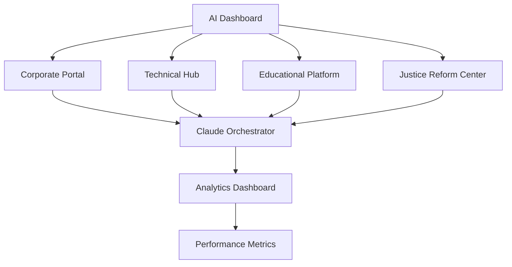

# StrayDog AI-Powered Justice Reform Ecosystem - Product Requirements Document

## 1. Product Overview

The StrayDog AI-Powered Justice Reform Ecosystem transforms the existing Hunter Green glassmorphic portfolio into a comprehensive multi-domain platform that leverages Claude 4.1 AI orchestration to advance justice reform through technology. This ecosystem combines cutting-edge AI capabilities with meaningful social impact, creating an intelligent platform that serves corporate clients, technical professionals, educational institutions, and justice reform organizations.

The platform addresses the critical need for AI-powered tools in justice reform while demonstrating advanced technical capabilities that position StrayDog Syndications as a leader in socially-conscious technology development.

## 2. Core Features

### 2.1 User Roles

| Role | Registration Method | Core Permissions |
|------|---------------------|------------------|
| Corporate Client | Email registration + company verification | Access to business AI tools, ROI calculators, case study generators |
| Technical Professional | GitHub OAuth + portfolio verification | Access to technical documentation, code examples, AI development tools |
| Educational Partner | Institution verification + educator credentials | Access to AI tutoring platform, curriculum tools, learning analytics |
| Justice Reform Advocate | Email registration + organization verification | Access to impact metrics, advocacy tools, research resources |
| System Administrator | Invitation-only access | Full platform management, AI orchestration controls, analytics dashboard |

### 2.2 Feature Module

Our AI-powered justice reform ecosystem consists of the following main domains:

1. **Corporate Domain**: AI-powered business intelligence, ROI analysis, and client engagement tools
2. **Technical Domain**: Advanced development tools, AI code generation, and technical documentation
3. **Educational Domain**: AI tutoring platform, curriculum development, and learning analytics
4. **Justice Reform Domain**: Impact tracking, advocacy tools, and research analytics
5. **AI Orchestration Hub**: Claude 4.1 integration, multi-domain coordination, and intelligent routing

### 2.3 Page Details

| Page Name | Module Name | Feature description |
|-----------|-------------|---------------------|
| AI Dashboard | Central Hub | Real-time AI performance metrics, domain coordination, intelligent routing between platforms |
| Corporate Portal | Business Intelligence | Lead qualification chatbot, ROI calculator, case study generator, client engagement analytics |
| Technical Hub | Development Tools | AI code generation, technical documentation, performance monitoring, developer resources |
| Educational Platform | AI Tutoring | Personalized learning paths, AI-powered curriculum, progress tracking, skill assessment |
| Justice Reform Center | Impact Analytics | Reform impact metrics, advocacy campaign tools, research data visualization, policy analysis |
| Claude Orchestrator | AI Management | Domain-specific AI contexts, intelligent content generation, cross-platform coordination |
| User Authentication | Access Control | Multi-domain login, role-based permissions, OAuth integration, security management |
| Analytics Dashboard | Performance Monitoring | Cross-domain analytics, AI performance metrics, user engagement tracking, impact measurement |

## 3. Core Process

### Phase 1 Flow (Days 1-7): AI Integration Foundation
Users access the AI Dashboard → Select domain-specific tools → Claude 4.1 orchestrator routes requests → Domain-specific AI contexts generate intelligent responses → Results displayed through glassmorphic interface → Performance metrics tracked

### Phase 2 Flow (Days 8-14): Business Platform Enhancement
Corporate clients → Lead qualification chatbot → AI-powered ROI analysis → Case study generation → Client engagement tracking → Business intelligence dashboard

### Phase 3 Flow (Days 15-21): Educational Platform Development
Educational partners → AI tutoring interface → Personalized learning paths → Progress tracking → Skill assessment → Curriculum optimization

### Phase 4 Flow (Days 22-30): Production Polish and Launch
All domains → Integrated experience → Cross-platform analytics → Performance optimization → Production deployment

## 4. User Interface Design

### 4.1 Design Style

- **Primary Colors**: Hunter Green (#355E3B) as brand foundation, Jet Black (#0B0B0B) for depth
- **Secondary Colors**: Electric Mint (#00D4AA), Cyber Purple (#7C3AED), Matrix Green (#00FF41) for tech accents
- **Button Style**: Advanced glassmorphic with backdrop blur, rounded corners (12px), interactive hover states
- **Typography**: JetBrains Mono for code, Inter for UI text, sizes ranging from 14px to 48px
- **Layout Style**: Glassmorphic card-based design with floating elements, top navigation with domain switching
- **Icons**: Lucide React icons with tech-focused iconography, consistent 24px sizing

### 4.2 Page Design Overview

| Page Name | Module Name | UI Elements |
|-----------|-------------|-------------|
| AI Dashboard | Central Hub | Glassmorphic hero section with real-time metrics, domain navigation cards with hover animations, performance charts with Hunter Green accents |
| Corporate Portal | Business Intelligence | Professional glassmorphic layout, ROI calculator with interactive inputs, lead qualification chat interface with Claude integration |
| Technical Hub | Development Tools | Code-focused dark theme, syntax-highlighted examples, interactive API documentation, performance monitoring widgets |
| Educational Platform | AI Tutoring | Learning-focused interface, progress visualization, interactive lesson components, accessibility-first design |
| Justice Reform Center | Impact Analytics | Data visualization dashboard, impact metrics with meaningful charts, advocacy tools with call-to-action elements |
| Claude Orchestrator | AI Management | Technical interface for AI configuration, domain context management, performance monitoring with real-time updates |

### 4.3 Responsiveness

Desktop-first responsive design with mobile optimization for all domains. Touch interaction optimization for educational platform. Glassmorphic effects scale appropriately across devices while maintaining performance.
