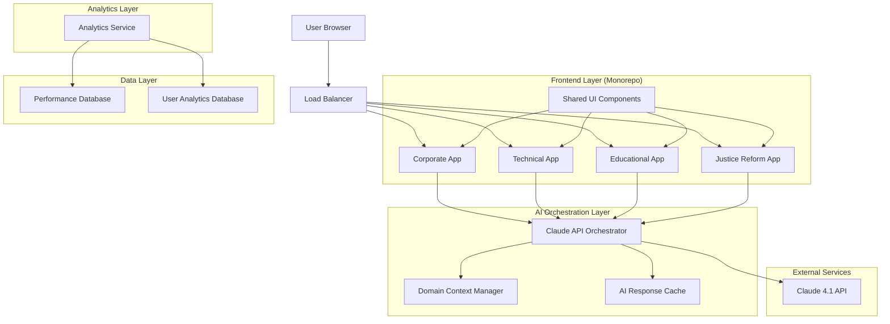
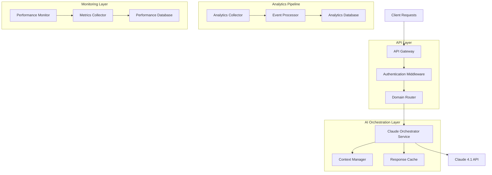
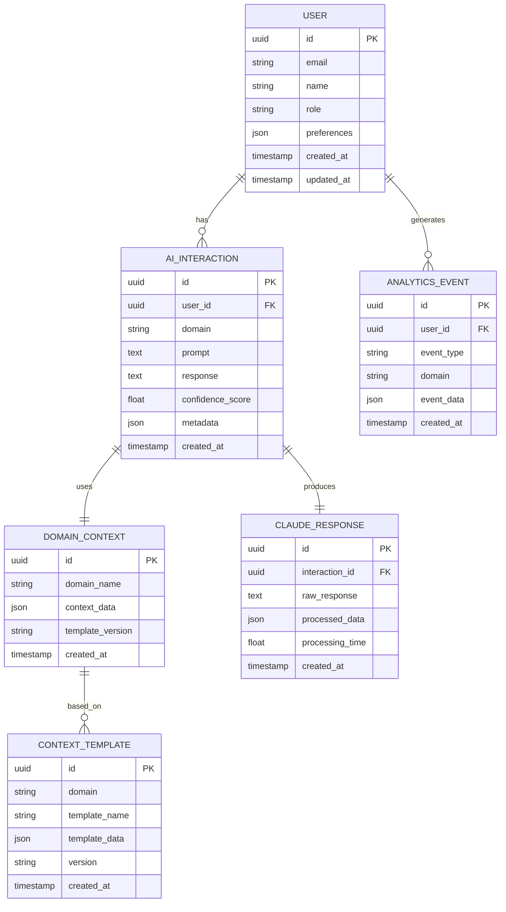

# StrayDog AI-Powered Justice Reform Ecosystem - Technical Architecture Document

## 1. Architecture Design



## 2. Technology Description

* Frontend: React\@18 + TypeScript\@5.1 + Vite\@4 + TailwindCSS\@3 + Framer Motion\@10

* Monorepo: Turborepo\@1.10 + npm workspaces

* AI Integration: Claude 4.1 API + custom orchestration layer

* State Management: Zustand\@4 + React Query\@4

* UI Components: Custom glassmorphic system + Lucide React icons

* Development Tools: VS Code + Cursor Pro + Trae 2.0 integration

* Deployment: Vercel (primary) + GitHub Pages (fallback)

## 3. Route Definitions

| Route                         | Purpose                                                                 |
| ----------------------------- | ----------------------------------------------------------------------- |
| /                             | AI Dashboard - Central hub with domain navigation and real-time metrics |
| /corporate                    | Corporate Portal - Business intelligence and client engagement tools    |
| /corporate/roi-calculator     | Interactive ROI calculator with Claude analysis                         |
| /corporate/case-studies       | AI-powered case study generator                                         |
| /corporate/lead-qualification | Lead qualification chatbot interface                                    |
| /technical                    | Technical Hub - Development tools and documentation                     |
| /technical/ai-demo            | AI code generation and technical demonstrations                         |
| /technical/documentation      | Interactive API documentation                                           |
| /educational                  | Educational Platform - AI tutoring and curriculum tools                 |
| /educational/tutoring         | Personalized AI tutoring interface                                      |
| /educational/curriculum       | Curriculum development tools                                            |
| /justice-reform               | Justice Reform Center - Impact analytics and advocacy tools             |
| /justice-reform/metrics       | Impact metrics dashboard                                                |
| /justice-reform/advocacy      | Advocacy campaign tools                                                 |
| /admin/claude-orchestrator    | Claude AI management interface (admin only)                             |
| /admin/analytics              | Cross-domain analytics dashboard                                        |
| /auth/login                   | Multi-domain authentication                                             |
| /auth/register                | User registration with role selection                                   |

## 4. API Definitions

### 4.1 Core API

Claude 4.1 Orchestration API

```
POST /api/claude/generate
```

Request:

| Param Name | Param Type | isRequired | Description                                                       |
| ---------- | ---------- | ---------- | ----------------------------------------------------------------- |
| domain     | string     | true       | Target domain (corporate, technical, educational, justice-reform) |
| prompt     | string     | true       | User input or request                                             |
| context    | object     | false      | Domain-specific context data                                      |
| userId     | string     | true       | User identifier for personalization                               |

Response:

| Param Name | Param Type | Description                  |
| ---------- | ---------- | ---------------------------- |
| response   | string     | Claude-generated response    |
| confidence | number     | AI confidence score (0-1)    |
| domain     | string     | Confirmed domain context     |
| metadata   | object     | Additional response metadata |

Example Request:

```json
{
  "domain": "corporate",
  "prompt": "Calculate ROI for justice reform technology implementation",
  "context": {
    "companySize": "enterprise",
    "industry": "legal-services"
  },
  "userId": "user_123"
}
```

User Analytics API

```
POST /api/analytics/track
```

Request:

| Param Name | Param Type | isRequired | Description                                    |
| ---------- | ---------- | ---------- | ---------------------------------------------- |
| event      | string     | true       | Event name (page\_view, ai\_interaction, etc.) |
| domain     | string     | true       | Domain where event occurred                    |
| userId     | string     | false      | User identifier (if authenticated)             |
| metadata   | object     | false      | Additional event data                          |

Response:

| Param Name | Param Type | Description             |
| ---------- | ---------- | ----------------------- |
| success    | boolean    | Tracking success status |
| eventId    | string     | Unique event identifier |

## 5. Server Architecture Diagram



## 6. Data Model

### 6.1 Data Model Definition



### 6.2 Data Definition Language

User Table (users)

```sql
-- Create users table
CREATE TABLE users (
    id UUID PRIMARY KEY DEFAULT gen_random_uuid(),
    email VARCHAR(255) UNIQUE NOT NULL,
    name VARCHAR(100) NOT NULL,
    role VARCHAR(50) DEFAULT 'user' CHECK (role IN ('user', 'corporate', 'technical', 'educational', 'justice_advocate', 'admin')),
    preferences JSONB DEFAULT '{}',
    created_at TIMESTAMP WITH TIME ZONE DEFAULT NOW(),
    updated_at TIMESTAMP WITH TIME ZONE DEFAULT NOW()
);

-- Create indexes
CREATE INDEX idx_users_email ON users(email);
CREATE INDEX idx_users_role ON users(role);
CREATE INDEX idx_users_created_at ON users(created_at DESC);
```

AI Interactions Table (ai\_interactions)

```sql
-- Create ai_interactions table
CREATE TABLE ai_interactions (
    id UUID PRIMARY KEY DEFAULT gen_random_uuid(),
    user_id UUID REFERENCES users(id) ON DELETE CASCADE,
    domain VARCHAR(50) NOT NULL CHECK (domain IN ('corporate', 'technical', 'educational', 'justice_reform')),
    prompt TEXT NOT NULL,
    response TEXT NOT NULL,
    confidence_score FLOAT CHECK (confidence_score >= 0 AND confidence_score <= 1),
    metadata JSONB DEFAULT '{}',
    created_at TIMESTAMP WITH TIME ZONE DEFAULT NOW()
);

-- Create indexes
CREATE INDEX idx_ai_interactions_user_id ON ai_interactions(user_id);
CREATE INDEX idx_ai_interactions_domain ON ai_interactions(domain);
CREATE INDEX idx_ai_interactions_created_at ON ai_interactions(created_at DESC);
CREATE INDEX idx_ai_interactions_confidence ON ai_interactions(confidence_score DESC);
```

Domain Context Table (domain\_contexts)

```sql
-- Create domain_contexts table
CREATE TABLE domain_contexts (
    id UUID PRIMARY KEY DEFAULT gen_random_uuid(),
    domain_name VARCHAR(50) NOT NULL,
    context_data JSONB NOT NULL,
    template_version VARCHAR(20) DEFAULT '1.0',
    created_at TIMESTAMP WITH TIME ZONE DEFAULT NOW()
);

-- Create indexes
CREATE INDEX idx_domain_contexts_domain ON domain_contexts(domain_name);
CREATE INDEX idx_domain_contexts_version ON domain_contexts(template_version);
```

Analytics Events Table (analytics\_events)

```sql
-- Create analytics_events table
CREATE TABLE analytics_events (
    id UUID PRIMARY KEY DEFAULT gen_random_uuid(),
    user_id UUID REFERENCES users(id) ON DELETE SET NULL,
    event_type VARCHAR(100) NOT NULL,
    domain VARCHAR(50),
    event_data JSONB DEFAULT '{}',
    created_at TIMESTAMP WITH TIME ZONE DEFAULT NOW()
);

-- Create indexes
CREATE INDEX idx_analytics_events_user_id ON analytics_events(user_id);
CREATE INDEX idx_analytics_events_type ON analytics_events(event_type);
CREATE INDEX idx_analytics_events_domain ON analytics_events(domain);
CREATE INDEX idx_analytics_events_created_at ON analytics_events(created_at DESC);
```

Initial Data

```sql
-- Insert domain context templates
INSERT INTO domain_contexts (domain_name, context_data, template_version) VALUES
('corporate', '{
  "focus": "business value, ROI, and professional communication for justice reform solutions",
  "tone": "professional",
  "expertise": ["business analysis", "ROI calculation", "client engagement", "justice reform impact"]
}', '1.0'),
('technical', '{
  "focus": "technical expertise with code examples, emphasizing developer experience and system architecture",
  "tone": "technical",
  "expertise": ["software development", "system architecture", "AI integration", "performance optimization"]
}', '1.0'),
('educational', '{
  "focus": "inclusive, accessible learning experiences for career transitions into tech",
  "tone": "supportive",
  "expertise": ["curriculum development", "personalized learning", "skill assessment", "career guidance"]
}', '1.0'),
('justice_reform', '{
  "focus": "empathetic, action-oriented content that drives social impact and volunteer engagement",
  "tone": "empathetic",
  "expertise": ["social impact", "policy analysis", "advocacy strategies", "community engagement"]
}', '1.0');
```

