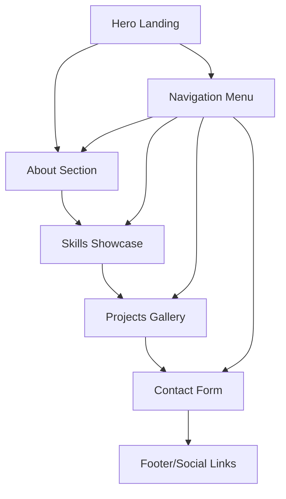

# StrayDog Syndications Portfolio Glassmorphic Revamp
## Product Requirements Document

## 1. Product Overview

Transform the current GitHub Pages portfolio into a distinctive, premium glassmorphic experience using StrayDog Syndications branding. This project eliminates generic design similarities by implementing a sophisticated design system with Hunter green palette, metallic accents, and advanced glassmorphism effects.

The portfolio will showcase professional capabilities through a cutting-edge visual design that reflects the StrayDog Syndications brand identity while maintaining excellent user experience and accessibility standards.

## 2. Core Features

### 2.1 Feature Module

Our glassmorphic portfolio transformation consists of the following main components:

1. **Design Token System**: Comprehensive CSS variables foundation with StrayDog color palette, glassmorphism effects, typography scales, and animation systems.
2. **Glassmorphic Component Library**: Reusable glass containers, cards, navigation elements, and interactive components with advanced visual effects.
3. **Enhanced Portfolio Sections**: Hero area, about section, skills showcase, projects gallery, and contact information with glassmorphic styling.
4. **Responsive Framework**: Mobile-first design with adaptive glassmorphism effects across all device sizes.
5. **Animation System**: Sophisticated micro-interactions and transitions using custom easing functions and metallic accent animations.

### 2.2 Page Details

| Page Name | Module Name | Feature description |
|-----------|-------------|---------------------|
| Portfolio Home | Hero Section | Implement glassmorphic hero container with StrayDog branding, animated background effects, and premium typography using Orbitron display font |
| Portfolio Home | Navigation Bar | Create glass navigation with backdrop blur effects, metallic accent borders, and smooth hover transitions |
| Portfolio Home | About Section | Design glass card layout with hunter green accents, professional headshot integration, and animated skill indicators |
| Portfolio Home | Skills Showcase | Build interactive skill cards with glassmorphic containers, metallic progress indicators, and category-based organization |
| Portfolio Home | Projects Gallery | Develop premium project cards with glass effects, hover animations, and metallic shimmer borders |
| Portfolio Home | Contact Section | Create glass contact form with hunter green accent buttons and metallic input field styling |
| Portfolio Home | Footer | Implement minimal glass footer with social links and StrayDog branding elements |

## 3. Core Process

**User Navigation Flow:**
Users land on the glassmorphic hero section with immediate visual impact from the premium design system. They scroll through seamlessly integrated sections with consistent glass effects and smooth animations. Interactive elements provide immediate feedback through metallic accents and hover states. The responsive design ensures optimal viewing across all devices while maintaining the sophisticated glassmorphic aesthetic.

## 4. User Interface Design

### 4.1 Design Style

**StrayDog Syndications Design System:**
- **Primary Colors**: Charcoal Black (#1C1C1C), Black Slate (#2B2B2B), Dark Graphite (#3A3A3A)
- **Hunter Green Palette**: Hunter Green Core (#355E3B), Deep Forest (#2A4B2F), Emerald Accent (#50C878), Sage Grey-Green (#9FB9A3)
- **Metallic Accents**: Silver Steel (#C0C0C0), Gunmetal (#48494B), Brushed Platinum (#D7D7D7)
- **Typography**: Orbitron/Audiowide for display text, Inter/Source Sans Pro for body text, JetBrains Mono for code
- **Glassmorphism Effects**: Backdrop blur (8px-16px), semi-transparent backgrounds (15%-25% opacity), subtle borders with metallic accents
- **Animation Style**: Smooth cubic-bezier transitions, metallic shimmer effects, glass hover states with glow

### 4.2 Page Design Overview

| Page Name | Module Name | UI Elements |
|-----------|-------------|-------------|
| Portfolio Home | Hero Section | Large glassmorphic container with backdrop blur, gradient background, Orbitron typography, animated metallic accents, responsive clamp() font sizing |
| Portfolio Home | Navigation | Fixed glass navbar with heavy backdrop blur, metallic border bottom, hover states with emerald glow, smooth transitions |
| Portfolio Home | About Section | Glass card with hunter green accent border, professional styling, animated entrance effects, responsive padding |
| Portfolio Home | Skills Section | Grid of glass skill cards, metallic progress bars, category-based color coding, hover animations with glow effects |
| Portfolio Home | Projects Gallery | Masonry-style glass cards, premium hover effects with metallic shimmer borders, smooth transform animations |
| Portfolio Home | Contact Form | Glass form container, hunter green accent buttons, metallic input styling, validation states with color feedback |

### 4.3 Responsiveness

Desktop-first approach with mobile-adaptive glassmorphism effects. Touch interaction optimization for mobile devices with adjusted hover states. Responsive typography using clamp() functions for fluid scaling. Adaptive blur effects and transparency levels based on device capabilities and performance considerations.