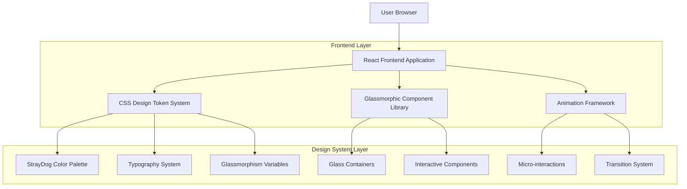

# StrayDog Syndications Glassmorphic Portfolio
## Technical Architecture Document

## 1. Architecture Design



## 2. Technology Description

- **Frontend**: React@18 + TypeScript + Vite
- **Styling**: CSS Custom Properties + Tailwind CSS@3 + PostCSS
- **Fonts**: Google Fonts (Orbitron, Inter, JetBrains Mono)
- **Icons**: React Icons (Font Awesome)
- **Deployment**: GitHub Pages with Vite build optimization

## 3. Route Definitions

| Route | Purpose |
|-------|----------|
| / | Single-page portfolio with glassmorphic sections (Hero, About, Skills, Projects, Contact) |

## 4. CSS Design Token System

### 4.1 Core Design Tokens

**StrayDog Color System:**
```css
:root {
  /* Primary Base Colors */
  --charcoal-black: #1C1C1C;
  --black-slate: #2B2B2B;
  --dark-graphite: #3A3A3A;
  
  /* Metallic Accent System */
  --silver-steel: #C0C0C0;
  --gunmetal: #48494B;
  --brushed-platinum: #D7D7D7;
  --metallic-shimmer: linear-gradient(135deg, var(--silver-steel) 0%, var(--brushed-platinum) 50%, var(--gunmetal) 100%);
  
  /* Hunter Green Comprehensive Palette */
  --hunter-green-core: #355E3B;
  --deep-forest: #2A4B2F;
  --emerald-accent: #50C878;
  --sage-grey-green: #9FB9A3;
  --metallic-hunter: #2F4F4F;
}
```

**Glassmorphism System:**
```css
:root {
  /* Glass Backgrounds */
  --glass-primary: rgba(28, 28, 28, 0.15);
  --glass-secondary: rgba(43, 43, 43, 0.20);
  --glass-tertiary: rgba(58, 58, 58, 0.25);
  
  /* Glass Borders */
  --glass-border-light: rgba(217, 217, 217, 0.1);
  --glass-border-medium: rgba(192, 192, 192, 0.15);
  --glass-border-heavy: rgba(159, 185, 163, 0.2);
  
  /* Blur Effects */
  --blur-subtle: blur(8px);
  --blur-medium: blur(12px);
  --blur-heavy: blur(16px);
  
  /* Shadow System */
  --shadow-glass-soft: 0 8px 32px 0 rgba(31, 38, 135, 0.15);
  --shadow-glass-medium: 0 12px 40px 0 rgba(53, 94, 59, 0.2);
  --shadow-glass-strong: 0 16px 48px 0 rgba(28, 28, 28, 0.25);
  --shadow-metallic-glow: 0 0 20px rgba(80, 200, 120, 0.3);
}
```

**Typography System:**
```css
:root {
  /* Font Families */
  --font-display: 'Orbitron', 'Audiowide', sans-serif;
  --font-body: 'Inter', 'Source Sans Pro', sans-serif;
  --font-mono: 'JetBrains Mono', 'Fira Code', monospace;
  
  /* Responsive Font Sizes */
  --text-xs: clamp(0.75rem, 0.7rem + 0.25vw, 0.875rem);
  --text-sm: clamp(0.875rem, 0.8rem + 0.375vw, 1rem);
  --text-base: clamp(1rem, 0.9rem + 0.5vw, 1.125rem);
  --text-lg: clamp(1.125rem, 1rem + 0.625vw, 1.25rem);
  --text-xl: clamp(1.25rem, 1.1rem + 0.75vw, 1.5rem);
  --text-2xl: clamp(1.5rem, 1.3rem + 1vw, 2rem);
  --text-3xl: clamp(1.875rem, 1.6rem + 1.375vw, 2.5rem);
  --text-4xl: clamp(2.25rem, 1.9rem + 1.75vw, 3rem);
}
```

**Animation System:**
```css
:root {
  /* Timing Functions */
  --ease-glass: cubic-bezier(0.4, 0, 0.2, 1);
  --ease-metallic: cubic-bezier(0.25, 0.46, 0.45, 0.94);
  --ease-bounce: cubic-bezier(0.68, -0.55, 0.265, 1.55);
  
  /* Durations */
  --duration-fast: 150ms;
  --duration-normal: 300ms;
  --duration-slow: 500ms;
  --duration-slower: 700ms;
}
```

### 4.2 Glassmorphic Component Library

**Glass Container System:**
```css
.glass-container {
  background: var(--glass-primary);
  backdrop-filter: var(--blur-medium);
  -webkit-backdrop-filter: var(--blur-medium);
  border: 1px solid var(--glass-border-light);
  border-radius: 20px;
  box-shadow: var(--shadow-glass-soft);
  position: relative;
  overflow: hidden;
}

.glass-container::before {
  content: '';
  position: absolute;
  top: 0;
  left: 0;
  right: 0;
  height: 1px;
  background: linear-gradient(90deg, transparent, var(--brushed-platinum), transparent);
  opacity: 0.3;
}
```

**Interactive Glass Cards:**
```css
.glass-card {
  @extend .glass-container;
  padding: 2rem;
  transition: all var(--duration-normal) var(--ease-glass);
}

.glass-card:hover {
  background: var(--glass-secondary);
  border-color: var(--glass-border-medium);
  box-shadow: var(--shadow-glass-medium), var(--shadow-metallic-glow);
  transform: translateY(-2px);
}

.glass-card-premium {
  @extend .glass-card;
  background: linear-gradient(135deg, var(--glass-primary) 0%, var(--glass-secondary) 100%);
  border: 2px solid transparent;
  background-clip: padding-box;
}

.glass-card-premium::after {
  content: '';
  position: absolute;
  top: -2px;
  left: -2px;
  right: -2px;
  bottom: -2px;
  background: var(--metallic-shimmer);
  border-radius: inherit;
  z-index: -1;
  opacity: 0;
  transition: opacity var(--duration-normal) var(--ease-glass);
}

.glass-card-premium:hover::after {
  opacity: 1;
}
```

**Navigation Glass System:**
```css
.glass-nav {
  background: var(--glass-primary);
  backdrop-filter: var(--blur-heavy);
  -webkit-backdrop-filter: var(--blur-heavy);
  border-bottom: 1px solid var(--glass-border-light);
  position: fixed;
  top: 0;
  width: 100%;
  z-index: 1000;
}

.glass-nav-item {
  padding: 1rem 1.5rem;
  color: var(--light-smoke);
  text-decoration: none;
  transition: all var(--duration-fast) var(--ease-glass);
  border-radius: 8px;
  position: relative;
}

.glass-nav-item:hover {
  background: var(--glass-secondary);
  color: var(--emerald-accent);
  box-shadow: var(--shadow-metallic-glow);
}
```

## 5. Component Architecture

### 5.1 React Component Structure

```typescript
// Core Portfolio Components
interface PortfolioSection {
  id: string;
  title: string;
  className?: string;
  children: React.ReactNode;
}

// Glassmorphic Container Component
interface GlassContainerProps {
  variant: 'primary' | 'secondary' | 'premium';
  blur: 'subtle' | 'medium' | 'heavy';
  children: React.ReactNode;
  className?: string;
  onClick?: () => void;
}

// Skill Card Component
interface SkillCardProps {
  name: string;
  level: number;
  category: 'frontend' | 'backend' | 'database' | 'tools';
  icon: React.ReactNode;
}

// Project Card Component
interface ProjectCardProps {
  title: string;
  description: string;
  technologies: string[];
  githubUrl?: string;
  liveUrl?: string;
  image?: string;
}
```

### 5.2 Responsive Design Implementation

**Breakpoint System:**
```css
:root {
  --bp-xs: 320px;
  --bp-sm: 640px;
  --bp-md: 768px;
  --bp-lg: 1024px;
  --bp-xl: 1280px;
  --bp-2xl: 1536px;
}

/* Mobile-first responsive glassmorphism */
@media (max-width: 768px) {
  .glass-container {
    backdrop-filter: var(--blur-subtle);
    border-radius: 16px;
  }
  
  .glass-card {
    padding: 1.5rem;
  }
}

@media (min-width: 1024px) {
  .glass-container {
    backdrop-filter: var(--blur-heavy);
  }
}
```

## 6. Performance Optimization

### 6.1 CSS Optimization
- Use CSS custom properties for consistent theming
- Implement efficient backdrop-filter usage with fallbacks
- Optimize animation performance with transform and opacity
- Minimize repaints with will-change property on animated elements

### 6.2 Asset Optimization
- Implement font-display: swap for web fonts
- Use WebP images with fallbacks
- Optimize SVG icons and illustrations
- Implement lazy loading for non-critical assets

### 6.3 Accessibility Considerations
- Maintain sufficient color contrast ratios
- Provide reduced motion alternatives
- Ensure keyboard navigation compatibility
- Implement proper ARIA labels and semantic HTML

## 7. Development Guidelines

### 7.1 CSS Methodology
- Use CSS custom properties for all design tokens
- Follow BEM naming convention for component classes
- Implement mobile-first responsive design
- Use logical properties for better internationalization

### 7.2 Component Development
- Create reusable glassmorphic components
- Implement proper TypeScript interfaces
- Follow React best practices for performance
- Ensure accessibility compliance in all components

### 7.3 Browser Support
- Modern browsers with backdrop-filter support
- Graceful degradation for older browsers
- Progressive enhancement approach
- Fallback styles for unsupported features