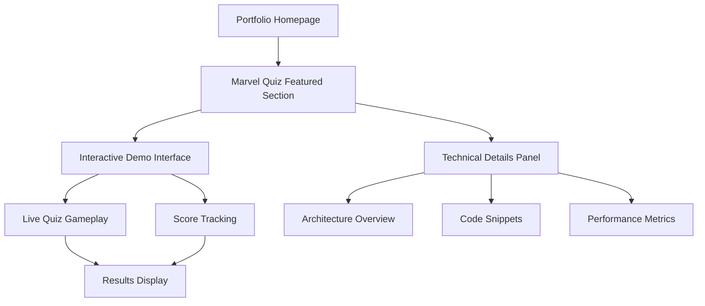

# Marvel Quiz Game - Featured Project Integration PRD

## 1. Product Overview

Transform the existing Marvel Quiz Game into the primary featured project showcase for the portfolio, demonstrating advanced web development skills through a fully functional PWA with real-time API integration, glassmorphic design, and modern JavaScript architecture.

The Marvel Quiz Game showcases technical expertise in API integration, progressive web app development, responsive design, and advanced JavaScript patterns - positioning it as the perfect centerpiece for a developer portfolio.

This integration will serve as a live demonstration of technical capabilities, allowing visitors to interact with a production-quality application while evaluating development skills.

## 2. Core Features

### 2.1 User Roles

| Role | Registration Method | Core Permissions |
|------|---------------------|------------------|
| Portfolio Visitor | No registration required | Can play quiz, view scores, experience full functionality |
| Potential Employer/Client | Direct access | Can assess technical implementation, code quality, and user experience |

### 2.2 Feature Module

Our Marvel Quiz featured project integration consists of the following main components:

1. **Featured Project Showcase**: Hero section replacement, live application preview, technical highlights display
2. **Interactive Demo Section**: Embedded quiz interface, real-time gameplay, score tracking
3. **Technical Details Panel**: Architecture overview, technology stack display, code snippets showcase
4. **Performance Metrics**: Live statistics, API response times, user engagement data

### 2.3 Page Details

| Page Name | Module Name | Feature description |
|-----------|-------------|---------------------|
| Portfolio Home | Featured Project Hero | Replace current placeholder with Marvel Quiz showcase. Display live preview, key features, and technical highlights with glassmorphic design |
| Portfolio Home | Interactive Demo | Embed functional quiz interface allowing visitors to play directly. Include difficulty selection, question display, scoring system |
| Portfolio Home | Technical Showcase | Display code architecture, API integration details, PWA features, and performance metrics in expandable panels |
| Portfolio Home | Live Statistics | Show real-time data including API response times, user interactions, and technical performance indicators |

## 3. Core Process

**Portfolio Visitor Flow:**
1. Visitor lands on portfolio homepage
2. Featured project section displays Marvel Quiz with live preview
3. Visitor can interact with embedded quiz interface
4. Technical details expand to show implementation specifics
5. Visitor experiences full functionality while viewing code quality

**Technical Demonstration Flow:**
1. Live application preview loads automatically
2. Interactive elements showcase responsive design
3. API integration demonstrates real-time data handling
4. PWA features highlight modern web development practices
5. Performance metrics display technical optimization

## 4. User Interface Design

### 4.1 Design Style

- **Primary Colors**: Glassmorphic theme with Marvel-inspired gradients (#667eea, #764ba2, #f093fb)
- **Secondary Colors**: Accent gradients (#4facfe, #00f2fe) and success/error states (#4caf50, #f44336)
- **Button Style**: Glassmorphic with subtle shadows, rounded corners (15px radius), hover animations
- **Font**: Inter font family with system fallbacks, responsive sizing using clamp()
- **Layout Style**: Card-based glassmorphic design with backdrop blur effects and subtle borders
- **Icons**: Marvel-themed with modern glassmorphic styling and smooth transitions

### 4.2 Page Design Overview

| Page Name | Module Name | UI Elements |
|-----------|-------------|-------------|
| Portfolio Home | Featured Project Hero | Glassmorphic container with live quiz preview, animated background, Marvel-themed gradients, responsive typography (clamp 1.5rem-4rem), floating elements with backdrop blur |
| Portfolio Home | Interactive Demo | Embedded quiz interface with question cards, answer buttons, progress indicators, timer display, score animations, difficulty selection with glassmorphic styling |
| Portfolio Home | Technical Panel | Expandable code blocks with syntax highlighting, architecture diagrams, performance charts, technology badges with hover effects, responsive grid layout |
| Portfolio Home | Live Statistics | Real-time counters with animated numbers, API status indicators, performance graphs, responsive data visualization with glassmorphic containers |

### 4.3 Responsiveness

Desktop-first design with mobile-adaptive breakpoints at 768px and 480px. Touch interaction optimization for mobile quiz gameplay. Responsive typography using clamp() functions. Flexible grid layouts that adapt to container constraints while maintaining glassmorphic visual hierarchy.