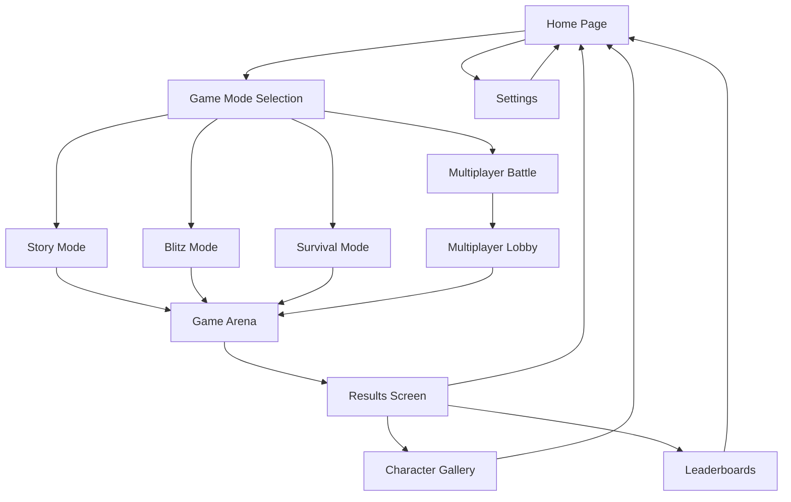

# 🎮 Marvel Quiz Game - Product Requirements Document

## 1. Product Overview

Build a cutting-edge Marvel Quiz Game that feels like it belongs in Tony Stark's holographic interface - a glassmorphic masterpiece with fluid animations, particle effects, and dynamic content pulled from Marvel's Developer API.

The game targets Marvel fans and quiz enthusiasts who want an immersive, interactive experience that combines entertainment with Marvel universe knowledge. This flagship application will showcase advanced web technologies and serve as the centerpiece of the Featured Projects section.

## 2. Core Features

### 2.1 User Roles

| Role              | Registration Method      | Core Permissions                                         |
| ----------------- | ------------------------ | -------------------------------------------------------- |
| Guest Player      | No registration required | Can play single-player modes, view basic leaderboards    |
| Registered Player | Email/GitHub OAuth       | Can save progress, access multiplayer, earn achievements |
| Premium Player    | Subscription upgrade     | Access to AR mode, exclusive content, advanced analytics |

### 2.2 Feature Module

Our Marvel Quiz Game consists of the following main pages:

1. **Home Page**: Hero section with 3D animations, game mode selection, leaderboard preview
2. **Game Arena**: Interactive quiz interface with glassmorphic panels, real-time scoring, animation effects
3. **Character Gallery**: Marvel character browser with API-driven content, achievement showcase
4. **Leaderboards**: Global and friend rankings, statistics dashboard, achievement tracking
5. **Settings**: Game preferences, accessibility options, account management
6. **Multiplayer Lobby**: Real-time matchmaking, room creation, friend invitations

### 2.3 Page Details

| Page Name         | Module Name           | Feature description                                                                                |
| ----------------- | --------------------- | -------------------------------------------------------------------------------------------------- |
| Home Page         | Hero Section          | Display 3D animated Marvel characters with particle effects, game mode cards with hover animations |
| Home Page         | Quick Stats           | Show player level, recent achievements, streak records with animated counters                      |
| Game Arena        | Question Display      | Present questions with glassmorphic panels, character images, multiple choice options              |
| Game Arena        | Answer Feedback       | Trigger repulsor blast for correct answers, Thanos snap for incorrect with screen shake            |
| Game Arena        | Score System          | Real-time score updates, combo multipliers, streak bonuses with arc reactor animations             |
| Game Arena        | Timer Component       | Countdown with infinity stone rotation, time freeze power-ups                                      |
| Character Gallery | Character Browser     | Grid layout with Marvel API data, search/filter functionality, character detail modals             |
| Character Gallery | Achievement Showcase  | Infinity stones collection progress, character badges, unlock notifications                        |
| Leaderboards      | Global Rankings       | Virtual scrolling leaderboard, skill-based matchmaking ratings                                     |
| Leaderboards      | Statistics Dashboard  | Performance analytics, difficulty progression, category breakdowns                                 |
| Settings          | Game Preferences      | Difficulty settings, animation toggles, sound controls                                             |
| Settings          | Accessibility Options | High contrast mode, screen reader support, keyboard navigation                                     |
| Multiplayer Lobby | Matchmaking           | Skill-based pairing, room creation, invite system                                                  |
| Multiplayer Lobby | Real-time Chat        | WebSocket-powered communication, emoji reactions                                                   |

## 3. Core Process

**Single Player Flow:**
Player selects game mode → Question generation from Marvel API → Answer submission → Feedback animation → Score calculation → Next question or game completion → Achievement check → Results display

**Multiplayer Flow:**
Player joins lobby → Matchmaking based on skill → Room creation → Synchronized question delivery → Real-time answer submission → Live score comparison → Power-up usage → Game completion → Ranking update

**Achievement Flow:**
Player completes action → Achievement criteria check → Unlock notification → Badge collection → Character bio unlock → Progress tracking

## 4. User Interface Design

### 4.1 Design Style

* **Primary Colors**: Electric blue (#00D4FF), Arc reactor gold (#FFD700), Deep space black (#0A0A0A)

* **Secondary Colors**: Cosmic purple (#6B46C1), Energy red (#EF4444), Glass white (rgba(255,255,255,0.1))

* **Button Style**: Glassmorphic with animated gradient borders, 3D hover effects, ripple animations

* **Fonts**: 'Orbitron' for headings (futuristic), 'Inter' for body text, sizes 14px-48px

* **Layout Style**: Floating glass panels with depth layers, cosmic particle backgrounds, holographic elements

* **Icons**: Marvel-themed custom icons, Heroicons for UI elements, animated SVG illustrations

### 4.2 Page Design Overview

| Page Name         | Module Name     | UI Elements                                                                                          |
| ----------------- | --------------- | ---------------------------------------------------------------------------------------------------- |
| Home Page         | Hero Section    | 3D animated Iron Man helmet, floating glass cards, particle system background, gradient text effects |
| Home Page         | Game Mode Cards | Glassmorphic panels with blur(20px), animated borders, hover scale transforms, mode-specific icons   |
| Game Arena        | Question Panel  | Central glass container, character portrait with holographic effect, animated question text          |
| Game Arena        | Answer Options  | Four glassmorphic buttons, hover glow effects, selection animations, feedback colors                 |
| Game Arena        | Score Display   | Arc reactor-styled counter, combo multiplier badges, streak indicators with pulsing effects          |
| Character Gallery | Character Grid  | Masonry layout, lazy-loaded images, hover reveal animations, modal overlays                          |
| Leaderboards      | Ranking Table   | Alternating glass rows, animated rank changes, player avatars, skill badges                          |
| Settings          | Control Panels  | Grouped glass sections, toggle switches with glow, slider controls, accessibility icons              |

### 4.3 Responsiveness

Desktop-first approach with mobile-adaptive breakpoints at 768px, 1024px, and 1440px. Touch interaction optimization for mobile devices including gesture controls for answer selection and swipe navigation. Particle effects scale down on mobile for performance optimization.

## 5. Game Modes Specification

### 5.1 Story Mode

* **Phase 1**: Origins (Iron Man → Avengers) - 20 questions, basic difficulty

* **Phase 2**: Expansion (Iron Man 3 → Ant-Man) - 25 questions, medium difficulty

* **Phase 3**: Infinity Saga (Civil War → Endgame) - 30 questions, hard difficulty

* **Phase 4+**: Multiverse (WandaVision → Current) - 35 questions, expert difficulty

* **Boss Battles**: Villain-specific rounds with unique animations and higher stakes

### 5.2 Blitz Mode

* 60-second rapid-fire questions with decreasing time per question

* Combo multipliers: 3x (5 streak), 5x (10 streak), 10x (15 streak)

* Power-ups: Time freeze (5 seconds), Skip token, Double points

* Dynamic difficulty scaling based on performance

### 5.3 Survival Mode

* Unlimited questions with increasing difficulty

* 3 lives system with health bar visualization

* Life regeneration through perfect answer streaks

* Leaderboard integration with personal best tracking

### 5.4 Multiplayer Battle

* Real-time 1v1 or tournament modes

* Skill-based matchmaking with ELO rating system

* Power-ups: Steal points, freeze opponent, shield, double damage

* Spectator mode for ongoing matches

## 6. Technical Requirements

### 6.1 Performance Targets

* First Contentful Paint: < 1.5 seconds

* Largest Contentful Paint: < 2.5 seconds

* Cumulative Layout Shift: < 0.1

* First Input Delay: < 100ms

* 60 FPS animations on desktop, 30 FPS on mobile

### 6.2 Browser Support

* Chrome 90+, Firefox 88+, Safari 14+, Edge 90+

* WebXR support for AR mode (Chrome/Edge only)

* Progressive enhancement for older browsers

### 6.3 Accessibility Standards

* WCAG 2.1 AAA compliance

* Screen reader compatibility with ARIA labels

* Keyboard navigation with visible focus indicators

* High contrast mode toggle

* Reduced motion preferences support

