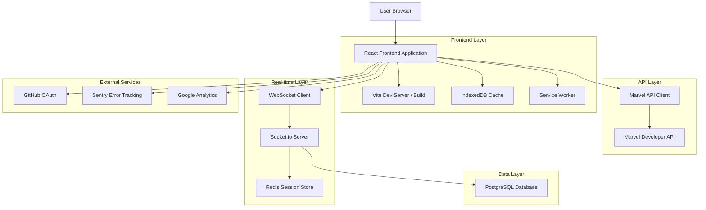
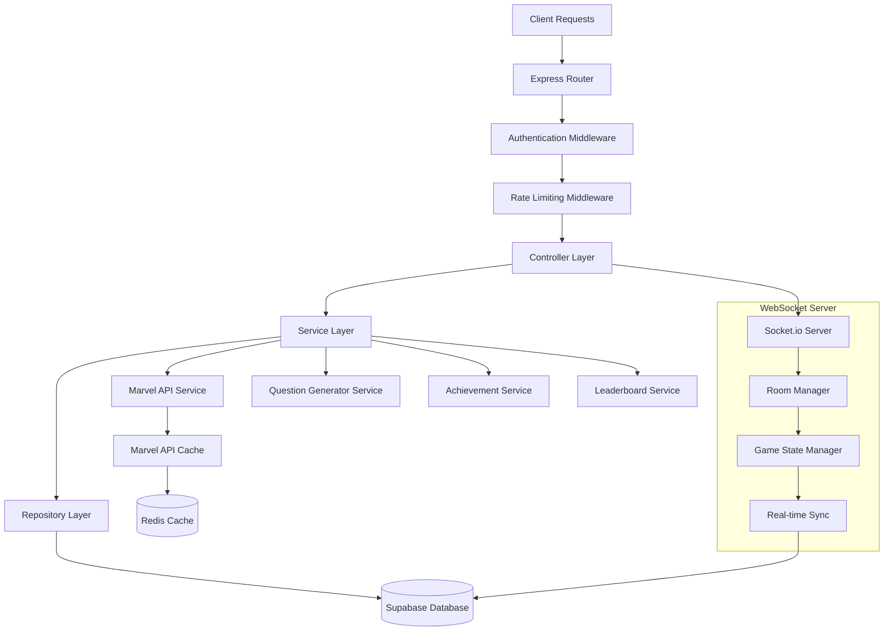
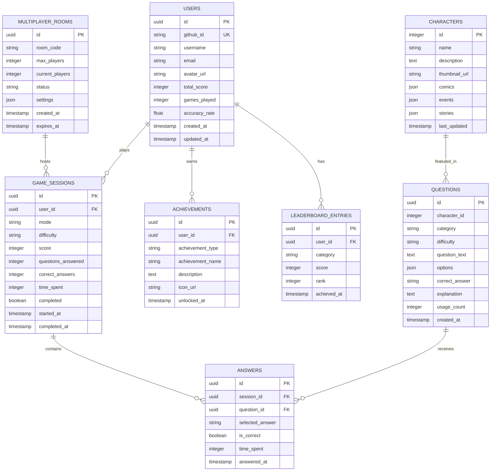

# 🏗️ Marvel Quiz Game - Technical Architecture Document

## 1. Architecture Design



## 2. Technology Description

* **Frontend**: React\@18.3 + TypeScript\@5.0 + Vite\@5.0

* **Styling**: Tailwind CSS\@3.4 + Custom Glassmorphism utilities

* **Animations**: Framer Motion\@11.0 + Three.js\@0.160 + React Three Fiber\@8.15

* **State Management**: Zustand\@4.4 + React Query\@5.0

* **Real-time**: Socket.io-client\@4.7

* **Storage**: IndexedDB (via Dexie.js\@3.2)

* **Authentication**: GitHub OAuth + JWT tokens

* **Backend**: Node.js\@20 + Express\@4.18 + Socket.io\@4.7

* **Database**: Supabase (PostgreSQL) + Redis\@7.2

* **Deployment**: Vercel (Frontend) + Railway (Backend)

## 3. Route Definitions

| Route                       | Purpose                                               |
| --------------------------- | ----------------------------------------------------- |
| /                           | Home page with hero section and game mode selection   |
| /game/:mode                 | Game arena for different modes (story/blitz/survival) |
| /multiplayer                | Multiplayer lobby and matchmaking                     |
| /multiplayer/battle/:roomId | Real-time multiplayer game session                    |
| /characters                 | Character gallery with Marvel API integration         |
| /leaderboards               | Global and category-specific rankings                 |
| /achievements               | Player achievement showcase and progress              |
| /profile                    | User profile and statistics dashboard                 |
| /settings                   | Game preferences and accessibility options            |
| /auth/callback              | OAuth authentication callback handler                 |

## 4. API Definitions

### 4.1 Marvel API Integration

**Character Data Fetching**

```
GET https://gateway.marvel.com/v1/public/characters
```

Request Headers:

| Header Name   | Value          | Description                             |
| ------------- | -------------- | --------------------------------------- |
| Authorization | API Key + Hash | MD5(timestamp + privateKey + publicKey) |

Query Parameters:

| Param Name     | Type   | Required | Description                   |
| -------------- | ------ | -------- | ----------------------------- |
| ts             | string | true     | Timestamp for hash generation |
| apikey         | string | true     | Public API key                |
| hash           | string | true     | MD5 hash for authentication   |
| limit          | number | false    | Number of results (max 100)   |
| offset         | number | false    | Pagination offset             |
| nameStartsWith | string | false    | Filter by character name      |

Response:

```json
{
  "code": 200,
  "status": "Ok",
  "data": {
    "offset": 0,
    "limit": 20,
    "total": 1564,
    "count": 20,
    "results": [
      {
        "id": 1011334,
        "name": "3-D Man",
        "description": "Character description",
        "thumbnail": {
          "path": "http://i.annihil.us/u/prod/marvel/i/mg/c/e0/535fecbbb9784",
          "extension": "jpg"
        },
        "comics": {
          "available": 12,
          "items": []
        }
      }
    ]
  }
}
```

### 4.2 Game API Endpoints

**Start Game Session**

```
POST /api/game/start
```

Request:

| Param Name | Type   | Required | Description                                  |
| ---------- | ------ | -------- | -------------------------------------------- |
| mode       | string | true     | Game mode (story/blitz/survival/multiplayer) |
| difficulty | string | false    | Difficulty level (easy/medium/hard/expert)   |
| playerId   | string | true     | Player identifier                            |

Response:

```json
{
  "sessionId": "uuid-v4",
  "questions": [],
  "timeLimit": 30,
  "totalQuestions": 10
}
```

**Submit Answer**

```
POST /api/game/answer
```

Request:

| Param Name | Type   | Required | Description                |
| ---------- | ------ | -------- | -------------------------- |
| sessionId  | string | true     | Game session identifier    |
| questionId | string | true     | Question identifier        |
| answer     | string | true     | Selected answer            |
| timeSpent  | number | true     | Time taken in milliseconds |

Response:

```json
{
  "correct": true,
  "score": 100,
  "totalScore": 850,
  "streak": 5,
  "multiplier": 2,
  "explanation": "Correct! Tony Stark became Iron Man in 2008."
}
```

### 4.3 Multiplayer WebSocket Events

**Join Room**

```javascript
socket.emit('join-room', {
  roomId: 'string',
  playerId: 'string',
  playerName: 'string'
});
```

**Question Sync**

```javascript
socket.on('question-sync', {
  questionId: 'string',
  question: 'string',
  options: ['A', 'B', 'C', 'D'],
  timeLimit: 30
});
```

**Answer Submission**

```javascript
socket.emit('submit-answer', {
  questionId: 'string',
  answer: 'string',
  timeSpent: 1500
});
```

## 5. Server Architecture Diagram



## 6. Data Model

### 6.1 Data Model Definition



### 6.2 Data Definition Language

**Users Table**

```sql
-- Create users table
CREATE TABLE users (
    id UUID PRIMARY KEY DEFAULT gen_random_uuid(),
    github_id VARCHAR(50) UNIQUE,
    username VARCHAR(100) NOT NULL,
    email VARCHAR(255) UNIQUE NOT NULL,
    avatar_url TEXT,
    total_score INTEGER DEFAULT 0,
    games_played INTEGER DEFAULT 0,
    accuracy_rate DECIMAL(5,2) DEFAULT 0.00,
    created_at TIMESTAMP WITH TIME ZONE DEFAULT NOW(),
    updated_at TIMESTAMP WITH TIME ZONE DEFAULT NOW()
);

-- Create indexes
CREATE INDEX idx_users_github_id ON users(github_id);
CREATE INDEX idx_users_total_score ON users(total_score DESC);

-- Grant permissions
GRANT SELECT ON users TO anon;
GRANT ALL PRIVILEGES ON users TO authenticated;
```

**Game Sessions Table**

```sql
-- Create game_sessions table
CREATE TABLE game_sessions (
    id UUID PRIMARY KEY DEFAULT gen_random_uuid(),
    user_id UUID REFERENCES users(id) ON DELETE CASCADE,
    mode VARCHAR(20) NOT NULL CHECK (mode IN ('story', 'blitz', 'survival', 'multiplayer')),
    difficulty VARCHAR(10) CHECK (difficulty IN ('easy', 'medium', 'hard', 'expert')),
    score INTEGER DEFAULT 0,
    questions_answered INTEGER DEFAULT 0,
    correct_answers INTEGER DEFAULT 0,
    time_spent INTEGER DEFAULT 0,
    completed BOOLEAN DEFAULT FALSE,
    started_at TIMESTAMP WITH TIME ZONE DEFAULT NOW(),
    completed_at TIMESTAMP WITH TIME ZONE
);

-- Create indexes
CREATE INDEX idx_game_sessions_user_id ON game_sessions(user_id);
CREATE INDEX idx_game_sessions_mode ON game_sessions(mode);
CREATE INDEX idx_game_sessions_score ON game_sessions(score DESC);

-- Grant permissions
GRANT SELECT ON game_sessions TO anon;
GRANT ALL PRIVILEGES ON game_sessions TO authenticated;
```

**Questions Table**

```sql
-- Create questions table
CREATE TABLE questions (
    id UUID PRIMARY KEY DEFAULT gen_random_uuid(),
    character_id INTEGER NOT NULL,
    category VARCHAR(50) NOT NULL,
    difficulty VARCHAR(10) NOT NULL,
    question_text TEXT NOT NULL,
    options JSONB NOT NULL,
    correct_answer VARCHAR(10) NOT NULL,
    explanation TEXT,
    usage_count INTEGER DEFAULT 0,
    created_at TIMESTAMP WITH TIME ZONE DEFAULT NOW()
);

-- Create indexes
CREATE INDEX idx_questions_character_id ON questions(character_id);
CREATE INDEX idx_questions_category ON questions(category);
CREATE INDEX idx_questions_difficulty ON questions(difficulty);
CREATE INDEX idx_questions_usage_count ON questions(usage_count);

-- Grant permissions
GRANT SELECT ON questions TO anon;
GRANT ALL PRIVILEGES ON questions TO authenticated;
```

**Characters Cache Table**

```sql
-- Create characters table for Marvel API cache
CREATE TABLE characters (
    id INTEGER PRIMARY KEY,
    name VARCHAR(255) NOT NULL,
    description TEXT,
    thumbnail_url TEXT,
    comics JSONB,
    events JSONB,
    stories JSONB,
    last_updated TIMESTAMP WITH TIME ZONE DEFAULT NOW()
);

-- Create indexes
CREATE INDEX idx_characters_name ON characters(name);
CREATE INDEX idx_characters_last_updated ON characters(last_updated);

-- Grant permissions
GRANT SELECT ON characters TO anon;
GRANT ALL PRIVILEGES ON characters TO authenticated;
```

**Initial Data**

```sql
-- Insert sample questions
INSERT INTO questions (character_id, category, difficulty, question_text, options, correct_answer, explanation) VALUES
(1009368, 'Origins', 'easy', 'What is the real name of Iron Man?', 
 '{"A": "Tony Stark", "B": "Steve Rogers", "C": "Bruce Banner", "D": "Peter Parker"}', 
 'A', 'Tony Stark is the billionaire genius who created the Iron Man suit.'),
(1009220, 'Powers', 'medium', 'What gives Captain America his superhuman abilities?', 
 '{"A": "Gamma radiation", "B": "Super Soldier Serum", "C": "Vibranium shield", "D": "Cosmic energy"}', 
 'B', 'The Super Soldier Serum enhanced Steve Rogers physical abilities to peak human potential.');

-- Insert achievement types
INSERT INTO achievements (user_id, achievement_type, achievement_name, description, icon_url) 
SELECT id, 'first_game', 'First Steps', 'Complete your first quiz game', '/icons/first-game.svg'
FROM users LIMIT 1;
```

## 7. Environment Configuration

### 7.1 Frontend Environment Variables

```env
# Marvel API
VITE_MARVEL_API_BASE_URL=https://gateway.marvel.com/v1/public
VITE_MARVEL_PUBLIC_KEY=your_marvel_public_key

# Backend API
VITE_API_BASE_URL=http://localhost:3001/api
VITE_WEBSOCKET_URL=http://localhost:3001

# Authentication
VITE_GITHUB_CLIENT_ID=your_github_client_id
VITE_AUTH_REDIRECT_URI=http://localhost:5173/auth/callback

# Analytics
VITE_GA_MEASUREMENT_ID=G-XXXXXXXXXX
VITE_SENTRY_DSN=your_sentry_dsn

# Feature Flags
VITE_ENABLE_AR_MODE=false
VITE_ENABLE_VOICE_COMMANDS=true
VITE_ENABLE_MULTIPLAYER=true
```

### 7.2 Backend Environment Variables

```env
# Server
PORT=3001
NODE_ENV=development
CORS_ORIGIN=http://localhost:5173

# Database
SUPABASE_URL=your_supabase_url
SUPABASE_ANON_KEY=your_supabase_anon_key
SUPABASE_SERVICE_KEY=your_supabase_service_key

# Redis
REDIS_URL=redis://localhost:6379

# Marvel API
MARVEL_PUBLIC_KEY=your_marvel_public_key
MARVEL_PRIVATE_KEY=your_marvel_private_key

# Authentication
JWT_SECRET=your_jwt_secret
GITHUB_CLIENT_ID=your_github_client_id
GITHUB_CLIENT_SECRET=your_github_client_secret

# External Services
SENTRY_DSN=your_sentry_dsn
```

## 8. Deployment Strategy

### 8.1 Frontend Deployment (Vercel)

* Automatic deployments from main branch

* Preview deployments for pull requests

* Environment variables configured in Vercel dashboard

* Custom domain with SSL certificate

* CDN optimization for global performance

### 8.2 Backend Deployment (Railway)

* Docker containerization with multi-stage builds

* Automatic scaling based on CPU/memory usage

* Health checks and monitoring

* Database migrations on deployment

* Redis instance for session management

### 8.3 CI/CD Pipeline

```yaml
# .github/workflows/deploy.yml
name: Deploy Marvel Quiz Game

on:
  push:
    branches: [main]
  pull_request:
    branches: [main]

jobs:
  test:
    runs-on: ubuntu-latest
    steps:
      - uses: actions/checkout@v4
      - uses: actions/setup-node@v4
        with:
          node-version: '20'
      - run: npm ci
      - run: npm run test
      - run: npm run build
      - run: npm run e2e

  deploy-frontend:
    needs: test
    if: github.ref == 'refs/heads/main'
    runs-on: ubuntu-latest
    steps:
      - name: Deploy to Vercel
        uses: amondnet/vercel-action@v25
        with:
          vercel-token: ${{ secrets.VERCEL_TOKEN }}
          vercel-org-id: ${{ secrets.ORG_ID }}
          vercel-project-id: ${{ secrets.PROJECT_ID }}

  deploy-backend:
    needs: test
    if: github.ref == 'refs/heads/main'
    runs-on: ubuntu-latest
    steps:
      - name: Deploy to Railway
        uses: railway-deploy@v1
        with:
          railway-token: ${{ secrets.RAILWAY_TOKEN }
```

