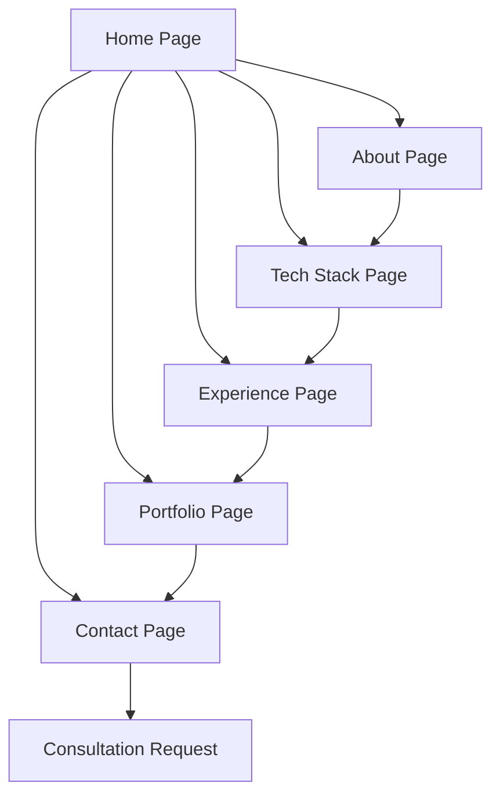

# Product Requirements Document - Eric 'Hunter' Petross Portfolio

## 1. Product Overview

A comprehensive digital portfolio showcasing Eric 'Hunter' Petross as an Applied AI Solutions Engineer with 20+ years of customer service excellence, specializing in full-stack development and LLM integration. The portfolio demonstrates his unique combination of customer empathy, high-pressure performance experience, and technical capability with proven live demonstrations.

The portfolio serves as a professional showcase for AI development projects and technical consulting opportunities, targeting enterprise clients seeking applied AI solutions and intelligent automation.

## 2. Core Features

### 2.1 User Roles

| Role | Registration Method | Core Permissions |
|------|---------------------|------------------|
| Visitor | Direct access | Can browse portfolio, view projects, access contact information |
| Potential Client | Contact form submission | Can request consultations, download technical specifications |

### 2.2 Feature Module

Our portfolio requirements consist of the following main pages:

1. **Home Page**: Hero section with dynamic typing animation, professional statistics showcase, navigation to key sections
2. **About Page**: Comprehensive professional background, differentiators, business leadership experience
3. **Tech Stack Page**: Detailed technology skills, programming languages, development tools, AI/LLM specializations
4. **Experience Page**: Professional work history, certifications, education, achievements
5. **Portfolio Page**: Live project demonstrations, GitHub analytics, interactive showcases
6. **Contact Page**: Professional contact information, digital business card, availability status

### 2.3 Page Details

| Page Name | Module Name | Feature Description |
|-----------|-------------|---------------------|
| Home Page | Hero Section | Display dynamic typing animation with key professional highlights, statistics cards showing 20+ years experience, Claude 4.1 specialization, live demos, full-stack expertise |
| Home Page | Navigation Bar | Provide seamless navigation to all portfolio sections with glassmorphic design |
| About Page | Professional Summary | Present Applied AI Solutions Engineer background, New England location, mission statement |
| About Page | Professional Differentiators | Showcase multi-platform development orchestration, 6 specialized IDEs, 3 deployed AI Slack agents, integrated AI workflow |
| About Page | Business Leadership | Highlight owner/operator status of 4 digital properties, community engagement at The Moth, enterprise AI solutions |
| Tech Stack Page | Programming Languages | Display proficiency in Python, TypeScript, JavaScript, HTML5, CSS3, SQL, VBA, Markdown with visual badges |
| Tech Stack Page | Frontend Development | Showcase React, Next.js, Tailwind CSS, Vite, React Router expertise |
| Tech Stack Page | Backend Development | Present Node.js, Express.js, MongoDB, Supabase capabilities |
| Tech Stack Page | AI & LLM Tools | Feature Claude, Gemini, Perplexity Pro, LangChain, Hugging Face, AI Slack Agents specializations |
| Tech Stack Page | Development Tools | List VS Code + Copilot, Cursor Composer, Xojo, WindSurf, Trae 2.0 + SOLO, StackBlitz, GitKraken, PolyPane |
| Experience Page | Current Positions | Detail The Moth community engagement instructor role, Outlier AI content writer position |
| Experience Page | Certifications | Present Justice Through Code AI Solutions Engineer, MongoDB certifications, full-stack development credentials |
| Experience Page | Education | Show CCRI Computer & Networking Technology degree progress, 3.40 GPA, STEM Pathway Scholar status |
| Portfolio Page | Live Projects | Feature interactive project showcase with advanced calculator, strategy games, certification tools |
| Portfolio Page | GitHub Analytics | Display real-time GitHub statistics, contribution graphs, top languages |
| Portfolio Page | Digital Ecosystem | Link to 4 active digital properties with professional badges |
| Contact Page | Professional Contact | Provide multiple contact methods, availability status, consultation request form |
| Contact Page | Digital Business Card | Embed QR code for instant connection, professional links |

## 3. Core Process

**Visitor Flow:**
Visitors land on the hero page with dynamic animations showcasing key professional highlights. They can navigate through the about section to understand professional background and differentiators, explore the comprehensive tech stack, review experience and certifications, examine live portfolio projects, and finally access contact information for potential collaboration.

**Client Engagement Flow:**
Potential clients review the professional summary and business leadership experience, assess technical capabilities through the tech stack showcase, examine live project demonstrations and GitHub analytics, and submit consultation requests through the contact form.

## 4. User Interface Design

### 4.1 Design Style

- **Primary Colors**: Hunter Green (#355E3B), Deep Forest (#2D4A32), Tokyo Night theme (#1A1B26)
- **Accent Colors**: Electric Blue (#7AA2F7), Purple (#BB9AF7), Coral (#F7768E), Green (#9ECE6A)
- **Button Style**: Glassmorphic with subtle shadows, rounded corners, hover animations
- **Typography**: Fira Code for headers, modern sans-serif for body text, 16-22px base sizes
- **Layout Style**: Card-based glassmorphic design, top navigation, responsive grid system
- **Icons**: Professional tech badges, animated SVG elements, GitHub-style contribution graphs

### 4.2 Page Design Overview

| Page Name | Module Name | UI Elements |
|-----------|-------------|-------------|
| Home Page | Hero Section | Dynamic typing animation, glassmorphic statistics cards, professional headshot, gradient backgrounds |
| Home Page | Navigation | Transparent glassmorphic navbar, smooth scroll navigation, mobile hamburger menu |
| About Page | Professional Summary | Clean typography, highlighted key phrases, professional imagery |
| Tech Stack Page | Technology Badges | Colorful skill badges, organized category sections, hover effects |
| Experience Page | Timeline | Vertical timeline design, expandable sections, certification badges |
| Portfolio Page | Project Showcase | Interactive project cards, GitHub integration, live demo links |
| Contact Page | Contact Form | Glassmorphic form design, validation feedback, professional styling |

### 4.3 Responsiveness

Desktop-first design with mobile-adaptive breakpoints, touch interaction optimization for mobile devices, progressive enhancement for advanced features, and consistent glassmorphic styling across all screen sizes.