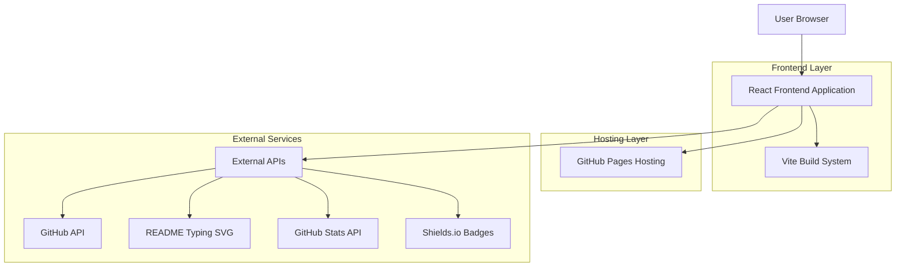
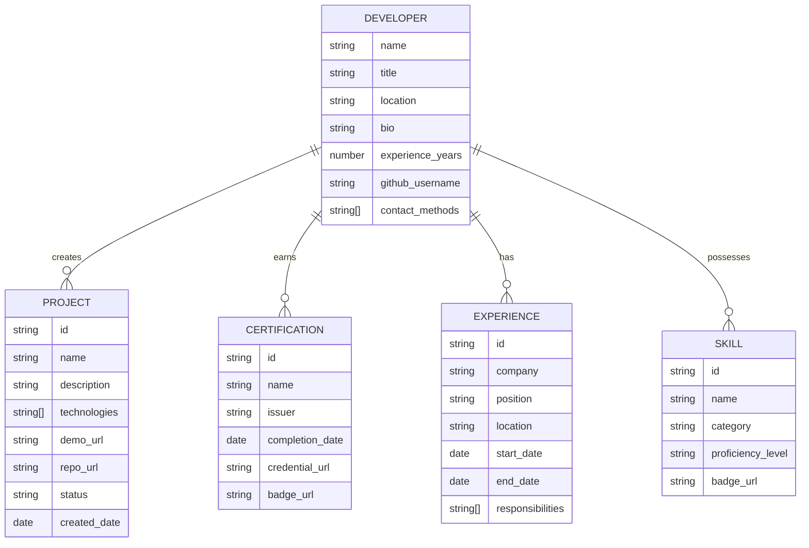

# Technical Architecture Document - Eric 'Hunter' Petross Portfolio

## 1. Architecture Design



## 2. Technology Description

* **Frontend**: React\@18 + TypeScript + Tailwind CSS + Vite

* **Styling**: Custom CSS with Hunter Green theme + Glassmorphism effects

* **Build System**: Vite for fast development and optimized production builds

* **Hosting**: GitHub Pages for static site deployment

* **External APIs**: GitHub API, GitHub Stats, Shields.io for dynamic content

## 3. Route Definitions

| Route       | Purpose                                                    |
| ----------- | ---------------------------------------------------------- |
| /           | Home page with hero section and dynamic typing animation   |
| /about      | Professional background and differentiators                |
| /tech-stack | Comprehensive technology skills showcase                   |
| /experience | Work history, certifications, and education                |
| /portfolio  | Live projects and GitHub analytics                         |
| /contact    | Professional contact information and consultation requests |

## 4. API Definitions

### 4.1 Core API

**GitHub User Statistics**

```
GET https://api.github.com/users/StrayDogSyn
```

Response:

| Param Name    | Param Type | Description               |
| ------------- | ---------- | ------------------------- |
| public\_repos | number     | Total public repositories |
| followers     | number     | GitHub followers count    |
| following     | number     | Following count           |
| created\_at   | string     | Account creation date     |

**GitHub Repository Data**

```
GET https://api.github.com/users/StrayDogSyn/repos
```

Response:

| Param Name        | Param Type | Description                  |
| ----------------- | ---------- | ---------------------------- |
| name              | string     | Repository name              |
| description       | string     | Repository description       |
| language          | string     | Primary programming language |
| stargazers\_count | number     | Stars count                  |
| html\_url         | string     | Repository URL               |

**Dynamic README Stats**

```
GET https://github-readme-stats.vercel.app/api?username=StrayDogSyn
```

Parameters:

| Param Name   | Param Type | Description               |
| ------------ | ---------- | ------------------------- |
| username     | string     | GitHub username           |
| theme        | string     | Visual theme (tokyonight) |
| show\_icons  | boolean    | Display icons             |
| hide\_border | boolean    | Hide border styling       |

## 5. Data Model

### 5.1 Data Model Definition



### 5.2 Data Definition Language

**Developer Profile (TypeScript Interface)**

```typescript
interface DeveloperProfile {
  name: string;
  title: string;
  location: string;
  bio: string;
  experienceYears: number;
  githubUsername: string;
  contactMethods: ContactMethod[];
  digitalProperties: DigitalProperty[];
  professionalDifferentiators: string[];
}

interface ContactMethod {
  type: 'email' | 'linkedin' | 'github' | 'website' | 'phone';
  value: string;
  label: string;
}

interface DigitalProperty {
  name: string;
  url: string;
  description: string;
  badgeColor: string;
}
```

**Project Data Structure**

```typescript
interface Project {
  id: string;
  name: string;
  description: string;
  technologies: string[];
  demoUrl?: string;
  repoUrl: string;
  status: 'completed' | 'in-progress' | 'planned';
  createdDate: Date;
  features: string[];
  highlights: string[];
}
```

**Certification Structure**

```typescript
interface Certification {
  id: string;
  name: string;
  issuer: string;
  completionDate: Date;
  credentialUrl?: string;
  badgeUrl: string;
  category: 'ai' | 'development' | 'database' | 'education';
  status: 'completed' | 'in-progress' | 'planned';
}
```

**Experience Data**

```typescript
interface Experience {
  id: string;
  company: string;
  position: string;
  location: string;
  startDate: Date;
  endDate?: Date;
  responsibilities: string[];
  achievements: string[];
  technologies: string[];
}
```

**Technology Skills**

```typescript
interface TechSkill {
  id: string;
  name: string;
  category: 'programming' | 'frontend' | 'backend' | 'ai' | 'tools' | 'platforms';
  proficiencyLevel: 'beginner' | 'intermediate' | 'advanced' | 'expert';
  badgeUrl: string;
  yearsExperience: number;
}
```

**Initial Data Population**

```typescript
// Core developer profile
const developerProfile: DeveloperProfile = {
  name: "Eric 'Hunter' Petross",
  title: "Applied AI Solutions Engineer",
  location: "New England",
  bio: "Specializing in full-stack development and LLM integration. I architect scalable applications that bridge cutting-edge AI capabilities with production-ready infrastructure.",
  experienceYears: 20,
  githubUsername: "StrayDogSyn",
  contactMethods: [
    { type: 'email', value: 'contact@straydog-syndications-llc.com', label: 'Professional Email' },
    { type: 'github', value: 'https://github.com/StrayDogSyn', label: 'GitHub Profile' },
    { type: 'linkedin', value: 'https://linkedin.com/in/straydogsyn', label: 'LinkedIn' }
  ],
  digitalProperties: [
    { name: 'StrayDog Syndications LLC', url: 'https://www.straydog-syndications-llc.com/', description: 'Main Company Site', badgeColor: '7AA2F7' },
    { name: 'Second Story', url: 'https://www.straydog-secondstory.org/', description: 'Digital Storytelling', badgeColor: 'BB9AF7' },
    { name: 'Tech Division', url: 'https://www.straydogsyndicationsllc.tech/', description: 'Technical Services', badgeColor: 'F7768E' },
    { name: 'Business Hub', url: 'https://straydogsyndicationsllc.biz/', description: 'Business Operations', badgeColor: '9ECE6A' }
  ],
  professionalDifferentiators: [
    'Parallel development across 6 specialized IDEs for maximum efficiency',
    '3 deployed AI Slack agents serving business automation needs',
    'Integrated AI workflow combining Claude, Perplexity, and specialized tools',
    'Owner/operator of 4 active digital properties',
    'Community engagement instructor at The Moth',
    'Applied AI solutions for enterprise clients'
  ]
};
```

